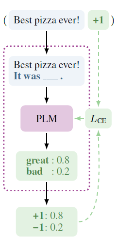

## PET介绍

预训练模型以具有某种“理解”自然语言的能力。但是， 原始的预训练模型只能执行模型训练当初训练时的任务（如自动编码和自动回归任务），
而这些任务通常与我们在现实中面临的各种任务不适配。
因此，我们需要想出一种方法来使预先训练的模型适应下游任务。

起初，人们在预训练模型的末端添加了一个额外的针对下游任务的架构，这称为微调。然而这种方式并不总令人满意，特别是当预训练任务偏离下游任务时。
因此，[提示学习](https://arxiv.org/abs/2111.01998) 被提出来，其中的核心思想是设计一个针对当前任务的完形填空模板，用来结合预训练模型和下游任务。

[Exploiting Cloze Questions for Few Shot Text Classification and Natural
Language Inference](https://arxiv.org/abs/2001.07676) 这篇论文提出了PET方法。它可以将输入文本重建为完形填空风格的短语，以便预先训练的模型更容易理解给定的任务。

由于不同任务之间输入文本和标签的设置不同，我们需要设计适当的完形填空样式。论文介绍了一个如下所示的情感分类示例。

给定的情感分析任务是：给定一个输入上下文（例如“有史以来最好的披萨！”），并且有限
类别（这里有 2 个类别，1 和 -1 分别表示正面和负面情绪）。
我们的模型需要在给定上下文的情况下自动预测每个情感类别的概率。

<div align=center></div>

如图所示，首先正面和负面标签被表述为“good”和“bad”。然后将模式设计为​​：

上下文 + 'It was' + 被遮挡的情感标签 + '.'。

将“good”和“bad”填充到蒙面位置的概率将由微调模型返回。


在这里我们可以看到它需要用户为每个给定的任务设计一个完形填空的样板，以及标签的文本与类别(数字）的对应关系。在我们的项目中，
这部分放在flagai/data/dataset/superglue/pvp.py里。 在给定任务的类下，
通常存在两个名为“verbalize”和“get_parts”的函数，verbalize用来将label转换为对应的含义文本，get_parts用来将不用的部分填充进设计好的完形填空模板里。
一个例子如下所示。请注意，对于一项任务，可以存在多种完形填空模板的设计。

```
    def get_parts(self, example: InputExample) -> FilledPattern:

        text_a = self.shortenable(example.text_a)
        text_b = self.shortenable(example.text_b)

        if self.pattern_id == 0:
            return [[self.mask], ':', text_a, text_b], []
        elif self.pattern_id == 1:
            return [[self.mask], ' Question:', text_a, text_b], []
        elif self.pattern_id == 2:
            return [text_a, '(', [self.mask], ')', text_b], []
        elif self.pattern_id == 3:
            return [text_a, text_b, '(', [self.mask], ')'], []
        elif self.pattern_id == 4:
            return ['[ Category:', [self.mask], ']', text_a, text_b], []
        elif self.pattern_id == 5:
            return [[self.mask], '-', text_a, text_b], []
        else:
            raise ValueError("No pattern implemented for id {}".format(
                self.pattern_id))

    def verbalize(self, label) -> List[str]:
        return YahooPVP.VERBALIZER[label]
```