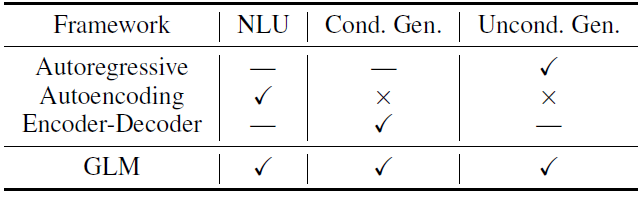
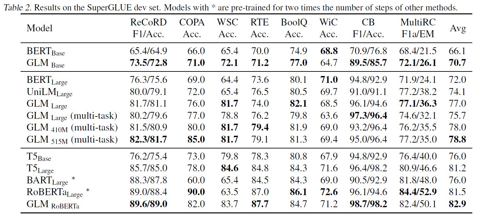
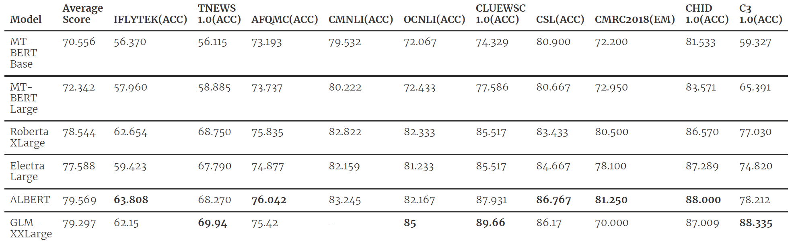
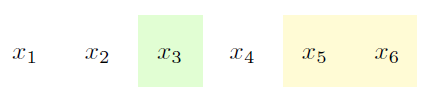
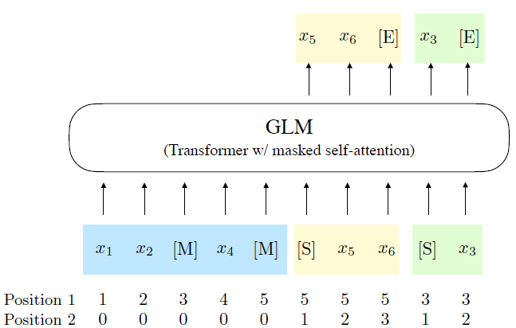

# Introduction to GLM

## Model Description
Currently, there exist several different pre-training model architectures: autoencoding models that only implement encoder architecture (e.g., BERT),
autoregressive models that only implement decoder (e.g., GPT), and encoder-decoder models that implement both encoder and decoder (e.g., T5).

The **GLM model** was proposed in [All NLP Tasks Are Generation Tasks: A General Pretraining Framework](https://arxiv.org/abs/2103.10360).
It claims to perform well in the three main categories of NLP taks: classification, unconditional generation, and conditional generation tasks.

The key features of GLM include:

- First task: Several spans of the text are masked following the idea of autoencoding. Those spans will be randomly rearranged and be predicted in an autoregressive manner. The masked spans covers 15% original tokens.
- Second task: Similar to the first task, but the span covers 50%-100% original tokens.
- Other model architecture changes compared with BERT
  - [Pre-LN](http://proceedings.mlr.press/v119/xiong20b.html)
  - 2D positional encoding: Each token has two positional encodings: the global position in the sentence, and the local position inside the masked span.
  - Feed-forward network is replaced with a linear layer

## Performance of GLM
The performance of GLM on SuperGLUE benchmark is listed below:

As shown in the chart below, GLM-XXlarge model has achieved an avarage score of 79.297 on the CLUE1.0 benchmark, and outperforms the rest of the models on TNEWs, OCNLI, CLUEWSC, and C3.

## Supported pre-trained GLM models
see [Tutorial 5: Supported models](https://model.baai.ac.cn/models)

## Step-by-step procedure of GLM
1) Following the example in the paper, the original text contains 6 tokens, and two spans are masked: first span contains the 3rd token and the second span contains the 5th and 6th token.

2) The input is divided into 2 parts, part A (corrupted text) and part B (masked spans). Note that the order of spans is shuffled here.
3) 

3) Input and output of GLM, the input contains token embeddings and 2 sets of positional encodings: the first set is the positions of each token, where the tokens in each masked span share the same position ID. The second set records the relative positions inside the masked span.

4) The self-attention mask that realizes both autoencoding upon corrupted text and autoregressive upon the masked spans

