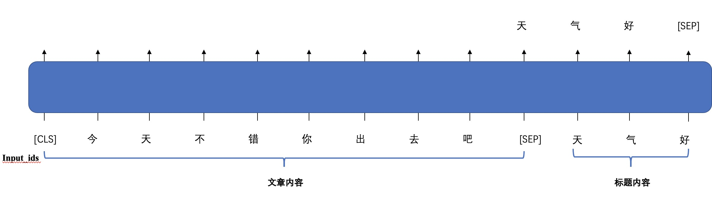

# GLM 例子：标题生成

## 背景
标题生成任务需要输入一段文本，模型根据输入文本输出对应的标题。这里使用`GLM-large-ch`作为样例,如果想要使用更大的百亿参数模型`GLM-10b-ch`请点[这里](https://model.baai.ac.cn/model-detail/100001)。



## 结果展示
#### 输入
```
"本文总结了十个可穿戴产品的设计原则而这些原则同样也是笔者认为是这个行业最吸引人的地方1为人们解决重复性问题2从人开始而不是从机器开始3要引起注意但不要刻意4提升用户能力而不是取代人",
"2007年乔布斯向人们展示iPhone并宣称它将会改变世界还有人认为他在夸大其词然而在8年后以iPhone为代表的触屏智能手机已经席卷全球各个角落未来智能手机将会成为真正的个人电脑为人类发展做出更大的贡献",
"雅虎发布2014年第四季度财报并推出了免税方式剥离其持有的阿里巴巴集团15％股权的计划打算将这一价值约400亿美元的宝贵投资分配给股东截止发稿前雅虎股价上涨了大约7％至5145美元"
```

#### 输出
```
可 穿 戴 产 品 设 计 原 则 十 大 原 则
乔 布 斯 宣 布 iphone 8 年 后 将 成 为 个 人 电 脑
雅 虎 拟 剥 离 阿 里 巴 巴 15 ％ 股 权
```

## 模型训练（train.py）

在命令行运行此命令：
```commandline
cd ./examples/glm_title_generation
python ./train.py
```

### 1.数据加载
小批量的样例数据放在 `/examples/glm_title_generation/data/`路径下， 其中训练数据的输入文本放在`train.src`里，训练数据的目标摘要文本放在`train.tgt`里

我们需要针对数据格式来定义数据加载方法，例如：对于`train.src`和`train.tgt`，我们定义下列文件读取函数，从文件中读取数据，得到输入文本和摘要文本：
1）定义加载过程
```python
def read_file():
    src = []
    tgt = []
    # src = ["article_1", "article_2", "article_3" ......]
    # tgt = ["title_1", "title_2", "title_3" ......]
    # 如果换为其他数据，修改处理方式即可，只需要构造好src以及对应tgt列表
    with open(src_dir, 'r', encoding='utf-8') as f:
        lines = f.readlines()
        for line in lines:
            src.append(line.strip('\n').lower())

    with open(tgt_dir, 'r', encoding='utf-8') as f:
        lines = f.readlines()
        for line in lines:
            tgt.append(line.strip('\n').lower())
    return src,tgt
```

2）定义数据集处理过程：
```python
class GLMTitleGenerationDataset(Dataset):

    def __init__(self, sents_src, sents_tgt):
        super(GLMTitleGenerationDataset, self).__init__()
        self.sents_src = sents_src
        self.sents_tgt = sents_tgt

    def __getitem__(self, i):
        source_text = self.sents_src[i]
        target_text = self.sents_tgt[i]
        data = tokenizer.encode_plus(source_text, target_text=target_text)
        return data

    def __len__(self):
        return len(self.sents_src)
```

3）定义数据迭代器（DataLoader）中的批处理函数（collate_fn），用于将一批（batch）数据填充（padding）成统一大小
```python
class GLMTitleGenerationCollateFN():
    def __init__(self, pad_id):
        self.pad_id = pad_id

    def pad_token(self, tokens, max_length):
        pad_len = max_length-len(tokens)
        tokens += [self.pad_id]*pad_len
        return tokens

    def pad_position_ids(self, position_ids, max_length):
        pad_len = max_length-len(position_ids[0])
        position_ids[0] += [len(position_ids[0])+x for x in range(pad_len)]
        position_ids[1] += [1] * pad_len
        return position_ids

    def pad_loss_mask(self, loss_mask, max_length):
        pad_len = max_length-len(loss_mask)
        loss_mask += [0] * pad_len
        return loss_mask

    def __call__(self, batch):
        input_ids = [data["input_ids"] for data in batch]
        target_ids = [data["target_ids"] for data in batch]
        position_ids = [data["position_ids"] for data in batch]
        attention_mask = [data['attention_mask'] for data in batch]
        loss_mask = [data['loss_mask'] for data in batch]

        max_length = max([len(t) for t in input_ids])
        for i in range(len(input_ids)):
            input_ids[i] = self.pad_token(input_ids[i], max_length)
            target_ids[i] = self.pad_token(target_ids[i], max_length)
            position_ids[i] = self.pad_position_ids(position_ids[i], max_length)
            loss_mask[i] = self.pad_loss_mask(loss_mask[i], max_length)
        return {
            'input_ids': torch.LongTensor(input_ids),
            'target_ids': torch.LongTensor(target_ids),
            'position_ids': torch.LongTensor(position_ids),
            'attention_mask': torch.LongTensor(attention_mask),
            'loss_mask': torch.LongTensor(loss_mask)
        }
```
4）获取训练数据
```python
train_src, train_tgt = read_file()
print('-----------train data length:', len(train_src))
my_collate_fn = GLMTitleGenerationCollateFN(pad_id=tokenizer.get_command_id('pad'))
train_dataset = GLMTitleGenerationDataset(train_src,
                                   train_tgt)
```
### 2.加载模型和分词器

```python
from flagai.auto_model.auto_loader import AutoLoader

# model_dir: 包含 1.config.json, 2.pytorch_model.bin, 3.vocab.txt,
# 如果本地没有，则会在modelhub上进行查找并下载
# Autoloader 能够自动构建模型与切词器
# 'title-generation' 是task_name
model_dir = "./state_dict/glm/"
AutoLoader("title-generation",model_name="GLM-large-ch",model_dir=model_dir)
model = auto_loader.get_model()
tokenizer = auto_loader.get_tokenizer()
```

### 3. 训练

实例化训练器Trainer, 设置训练参数。

```python
import torch.cuda
from flagai.trainer import Trainer

device = torch.device("cuda" if torch.cuda.is_available() else "cpu")
trainer = Trainer(
    env_type="pytorch",
    experiment_name="glm-title-generation",
    batch_size=1,
    gradient_accumulation_steps=1,
    lr=2e-4,
    weight_decay=1e-3,
    epochs=10,
    log_interval=10,
    eval_interval=10000,
    load_dir=None,
    pytorch_device=device,
    save_dir="checkpoints",
    save_interval=1,
    num_checkpoints=1,

)
```
将模型、数据、批处理函数输入训练器开始训练：
```python
trainer.train(model,
              train_dataset=train_dataset,
              collate_fn=my_collate_fn)
```

## 生成（generate.py）
运行前修改模型配置路径model_dir，训练好的模型路径model_save_path。然后在命令行运行此命令：
```commandline
cd ./examples/glm_title_generation
python ./generate.py
```
可选择基于概率筛选的随机抽样（random sample）或集束搜索（beamsearch）两种生成方式：
```python
print(predictor.predict_generate_randomsample(text,out_max_length=66, top_k=10, top_p=.1,
                                      repetition_penalty=4.0, temperature=1.2))
print(predictor.predict_generate_beamsearch(text, out_max_length=66, beam_size=10))
```
