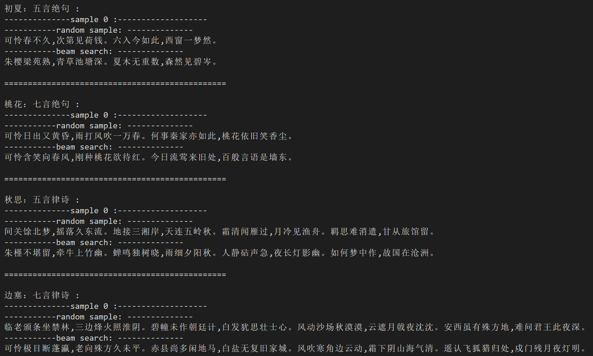

# GLM 例子：古诗生成

## 古诗背景介绍
中国古代近体诗有两种体裁：绝句和律诗。绝句规定全诗四句。律诗规定全诗八句。每句话含五个或七个汉字，称为五言或七言。总共有四种类型，见下表。

|     | 绝句 | 律诗 |
|  ----  | ---- | ---- |
| 五言 | 五言绝句 | 五言律诗 |
| 七言 | 七言绝句 | 七言律诗 |

一个五言绝句的示例：

**静夜思** 李白

床前明月光，疑是地上霜。

举头望明月，低头思故乡。


## 生成结果展示
#### 输入古诗标题与体裁
```
"桃花：七言绝句"
```
#### 输出诗句
```
"可怜含笑向春风,刚种桃花欲待红。今日流莺来旧处,百般言语是墙东。"
```
## 模型训练（train.py）

在命令行运行此命令：
```commandline
cd ./examples/glm_poetry_generation
python ./train.py
```
这里使用`GLM-large-ch`模型作为样例, 如果想要使用更大规模的百亿参数模型`GLM-10b-ch`请点[这里](https://model.baai.ac.cn/model-detail/100001)。
### 1.准备训练数据
1）从文件中读取数据

样例数据在 `./examples/glm_poetry_generation/data/`路径下，其中训练数据的输入文本放在`train.src`里，训练数据的目标摘要文本放在`train.tgt`里

我们需要针对数据格式来定义数据加载方法，例如：对于`train.src`和`train.tgt`，我们定义下列文件读取函数，从文件中读取数据，得到输入文本和摘要文本：
```python
def read_file():
    src = []
    tgt = []
    # src = ["春晓：五言绝句", "标题：五言律诗",......]
    # tgt = ["春眠不觉晓，处处闻啼鸟。夜来风雨声，花落知多少。", "诗句...", ......]
    # 如果换为其他数据，修改处理方式即可，只需要构造好src以及对应tgt列表
    with open(src_dir, 'r', encoding='utf-8') as f:
        for line in f:
            line = line.strip()
            if "：" in line:
                l = line.split("：")  #line eg:"初夏：五言绝句"
                #if there are more than one '：', get title before the first '：'
                title, style = l[0], l[-1]
                if len(title) > 20:
                    title = title[:20]  #cut the longer title
                line = "：".join([title, style])
            src.append(line)
    with open(tgt_dir, 'r', encoding='utf-8') as f:
        for line in f:
            tgt.append(line.strip())
    assert len(src) == len(tgt), 'lines not equal!'
    return src, tgt
```
2）定义数据迭代器（DataLoader）：
```python
class GLMPoetryDataset(Dataset):
    def __init__(self, sents_src, sents_tgt):
        super(GLMPoetryDataset, self).__init__()
        self.sents_src = sents_src
        self.sents_tgt = sents_tgt

    def __getitem__(self, i):
        source_text = self.sents_src[i]
        target_text = self.sents_tgt[i]
        data=tokenizer.encode_plus(source_text,
            target_text=target_text)
        return data

    def __len__(self):
        return len(self.sents_src)
```
其中tokenizer.encode_plus()方法将目标字符串转换为GLM模型的输入token序号和位置编码等数据

3）定义数据迭代器（DataLoader）中的collate_fn，用于将一批（batch）数据填充（padding）成统一大小
```python
class GLMPoetryDynamicCollateFN():
    def __init__(self, pad_id):
        self.pad_id = pad_id

    def pad_token(self, tokens, max_length):
        pad_len = max_length-len(tokens)
        tokens += [self.pad_id]*pad_len
        return tokens

    def pad_position_ids(self, position_ids, max_length):
        pad_len = max_length-len(position_ids[0])
        position_ids[0] += [len(position_ids[0])+x for x in range(pad_len)]
        position_ids[1] += [1] * pad_len
        return position_ids

    def pad_loss_mask(self, loss_mask, max_length):
        pad_len = max_length-len(loss_mask)
        loss_mask += [0] * pad_len
        return loss_mask

    def __call__(self, batch):
        input_ids = [data["input_ids"] for data in batch]
        target_ids = [data["target_ids"] for data in batch]
        position_ids = [data["position_ids"] for data in batch]
        attention_mask = [data['attention_mask'] for data in batch]
        loss_mask = [data['loss_mask'] for data in batch]

        max_length = max([len(t) for t in input_ids])
        for i in range(len(input_ids)):
            input_ids[i] = self.pad_token(input_ids[i], max_length)
            target_ids[i] = self.pad_token(target_ids[i], max_length)
            position_ids[i] = self.pad_position_ids(position_ids[i], max_length)
            loss_mask[i] = self.pad_loss_mask(loss_mask[i], max_length)
        return {
            'input_ids': torch.LongTensor(input_ids),
            'target_ids': torch.LongTensor(target_ids),
            'position_ids': torch.LongTensor(position_ids),
            'attention_mask': torch.LongTensor(attention_mask),
            'loss_mask': torch.LongTensor(loss_mask)
        }
```
4）获取训练数据
```python
train_src, train_tgt = read_file()
print('-----------train data length:', len(train_src))
my_collate_fn = GLMPoetryDynamicCollateFN(pad_id=tokenizer.get_command_id('pad'))
train_dataset = GLMPoetryDataset(train_src,
                                   train_tgt)
```
### 2.加载模型和分词器

```python
from flagai.auto_model.auto_loader import AutoLoader

# model_dir: 包含 1.config.json, 2.pytorch_model.bin, 3.vocab.txt,
# 如果本地没有，则会在modelhub上进行查找并下载
# Autoloader 能够自动构建模型与切词器
# 'poetry' 是task_name
model_dir = "./state_dict/"
AutoLoader("poetry",model_name="GLM-large-ch",model_dir=model_dir)
model = auto_loader.get_model()
tokenizer = auto_loader.get_tokenizer()
```

### 3. 训练

实例化训练器Trainer, 设置训练参数。
```python
from flagai.trainer import Trainer
trainer = Trainer(
    env_type="pytorch",
    experiment_name="glm_poetry",
    batch_size=4,
    gradient_accumulation_steps=1,
    lr=2e-4,
    weight_decay=2e-8,
    epochs=100,
    log_interval=10,  
    tensorboard_dir="tbsummary",
    eval_interval=2000000,
    load_dir=None,
    save_dir="checkpoints_poetry",
    save_interval=1,
)
```
将模型、数据、collate_fn输入训练器开始训练：
```python
trainer.train(model,
              train_dataset=train_dataset,
              collate_fn=my_collate_fn)
```            


## 生成（generate.py）
在命令行运行此命令：
```commandline
cd ./examples/glm_poetry_generation
python ./generate.py
```
可选择基于概率筛选的随机抽样（random sample）或集束搜索（beamsearch）两种生成方式：
```python
print(predictor.predict_generate_randomsample(text,out_max_length=66, top_k=10, top_p=.1,
                                      repetition_penalty=4.0, temperature=1.2))
print(predictor.predict_generate_beamsearch(text, out_max_length=66, beam_size=10))
```


生成古诗结果示例：



