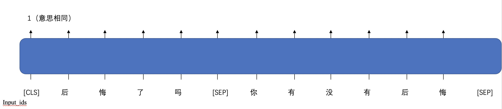

# BERT 语义匹配例子

## 背景
语义匹配任务是判断输入的两个句子意思是否一致，需要输入句子对，输出2分类（两句话意思相同或不同）的结果。



## 结果展示

#### 输入
```python
test_data = [["后悔了吗","你有没有后悔"],
             ["打开自动横屏","开启移动数据"],
             ["我觉得你很聪明","你聪明我是这么觉得"]]
```
#### 输出
```
1
0
1
```
1表示两个句子意思相同，0表示不相同。
## 使用

### 1.数据加载
样例数据在 /examples/bert_semantic_matching/data/

需要针对数据格式定义数据加载方法，例如：
```python
def read_file(data_path):
    src = []
    tgt = []
    ##TODO read data file to load src and tgt, for example:
    ## src = [["article_1_1", "article_1_2"], ["article_2_1", "artile_2_2"], ......]
    ## tgt = [1, 0, ......]
    ## no matter what data you use, you need to construct the right src and tgt.
    with open(data_path) as f:
        lines = f.readlines()
    for line in lines:
        line = line.split("\t")
        if len(line) == 3:
            sents_tgt.append(int(line[2]))
            sents_src.append([line[0], line[1]])

    return src,tgt
```

### 2.模型与切词器加载

```python
from flagai.auto_model.auto_loader import AutoLoader

# the model dir, which contains the 1.config.json, 2.pytorch_model.bin, 3.vocab.txt,
# or we will download these files from the model hub to this dir.
model_dir = "./state_dict/"
# Autoloader can build the model and tokenizer automatically.
# 'classification' is the task_name.
auto_loader = AutoLoader("classification",
                         model_name="RoBERTa-base-ch",
                         model_dir=model_dir)
model = auto_loader.get_model()
tokenizer = auto_loader.get_tokenizer()
```

### 3. 训练
在命令行中输入：
```commandline
python ./train.py
```
调整训练参数：
```python
from flagai.trainer import Trainer
import torch
device = torch.device("cuda" if torch.cuda.is_available() else "cpu")
trainer = Trainer(env_type="pytorch",
                  experiment_name="roberta-base-ch-semantic-matching",
                  batch_size=8, gradient_accumulation_steps=1,
                  lr = 1e-5,
                  weight_decay=1e-3,
                  epochs=10, log_interval=100, eval_interval=500,
                  load_dir=None, pytorch_device=device,
                  save_dir="checkpoints_semantic_matching",
                  save_interval=1
                  )
```
切分训练集验证集
```python
src, tgt = read_file(data_path=train_path)
data_len = len(src)
train_size = int(data_len * 0.9)
train_src = src[: train_size]
train_tgt = tgt[: train_size]

val_src = src[train_size: ]
val_tgt = tgt[train_size: ]

train_dataset = BertClsDataset(train_src, train_tgt)
val_dataset = BertClsDataset(val_src, val_tgt)
```

### 生成
如果你已经训练好了一个模型，为了更加直观的看到结果，可以进行测试生成

首先调整训练好的模型的路径：
```python
model_save_path = "./checkpoints_semantic_matching/9000/mp_rank_00_model_states.pt"
```
运行：
```commandline
python ./generate.py
```
然后可以查看运行结果。
