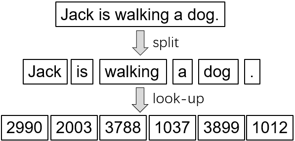

# 如何构建和应用分词器

## 什么是分词？
分词是 NLP 项目预处理阶段的一个基本步骤，其目的是将散乱的原始文本转换为规整的数字序列， 以便机器学习系统使用。

在分词过程中，分词器首先将自然语言文本拆分为语义单元, 这些语义单元被称为子词(token)。随后分词器通过一个词表文件查找子词的序号，这样原始文本就被转换为了一个数字的序列。

<div align=center></div>

值得注意的是，不同的分词器可以有不同的文本分割方式，并且有不同的词表文件,  相关算法的介绍可以在 [这里](tokenization.md) 查看。


## 加载分词器
```python
from flagai.data.tokenizer import Tokenizer
model_name = "GLM-large-ch"
tokenizer = Tokenizer.from_pretrained(model_name)
```
在这一步里，模型仓库中的词表文件将被自动下载到`cache_dir`参数中指定的路径, 默认设置为`~/.cache/FlagAI/{model_name}`。


## 应用分词器
让我们使用一个分词器将原始文本编码成数字序列，然后将数字序列恢复成原始文本：
```python
text = "Jack is walking a dog."                  # 输入文本
encoded_ids = tokenizer.EncodeAsIds(text)        # 数字序列
# 现在 encoded_ids = [2990, 2003, 3788, 1037, 3899, 1012]
recoverd_text = tokenizer.DecodeIds(encoded_ids) # 将数字序列恢复为文本
# recovered_text此时与text相同
```

## 创建新的分词器
想创建新的分词器的时候, 需要这么做:
### 1. 在`/flagai/tokenizer`目录下建立一个新的目录

### 2. 使用Hugging Face transformer支持的分词器来帮助创建
飞智支持借用Hugging Face里的分词器来创建新的分词器，以T5Tokenizer为例
```python
from transformers import T5Tokenizer
from ..tokenizer import Tokenizer
class T5BPETokenizer(Tokenizer):
    def __init__(self, model_type_or_path="t5-base", cache_dir=None):
        self.text_tokenizer = T5Tokenizer.from_pretrained(model_type_or_path,
                                                            cache_dir=cache_dir)
        self.text_tokenizer.max_len = int(1e12)
```
