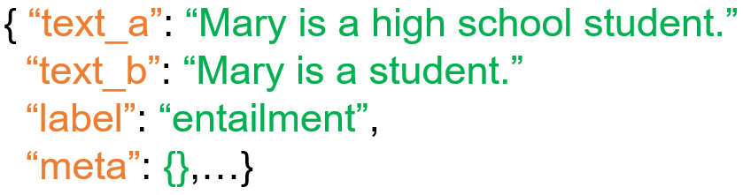
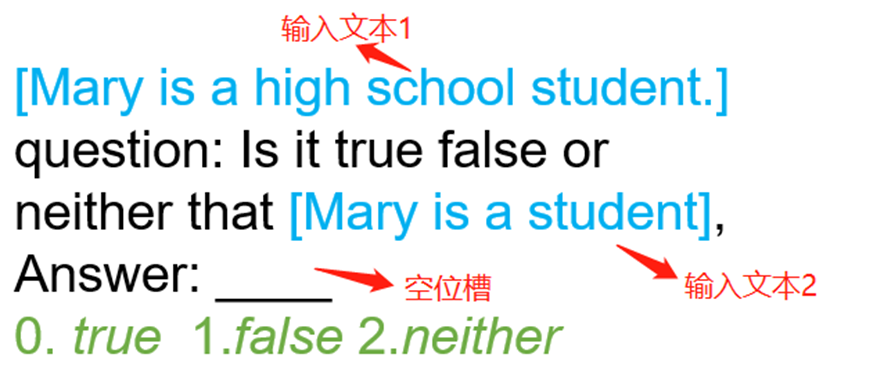

# 数据集处理流程
构建数据集的过程就是NLP的数据预处理过程，其主要目的是将原始的散乱的文件数据重新整理成统一结构的数据，以便语言模型能够直接使用。构建数据集样例的主要流程如下所示（以`CommitmentBank`数据集为例）：

<div align=center></div>

目前项目里存在三种数据预处理的情况，即对分类任务的微调，预训练, 以及对生成任务的微调。我们在接下来会分别展开。

<!-- toc -->

- [1 数据处理分类任务微调](#1 数据处理分类任务微调)
  - [1.1 应用代码](#1.应用代码)
  - [1.2 初步读取并处理数据集](#1.2 初步读取并处理数据集)
    - [1.2a 加载数据集](#1.2a 加载数据集)
    - [1.2b 统一数据集结构](#1.2b 统一数据集结构)
  - [1.3 将数据整理成模型的输入](#1.3 将数据整理成模型的输入)
    - [1.3a 构建完形填空模板](#1.3a 构建完形填空模板)
    - [1.3b 分词并构造输入样例](#1.3b 分词并构造输入样例)
- [2 数据处理：预训练](#数据处理：分类任务微调)
  - [2.1 预训练任务数据格式样例](#2.1 预训练任务数据格式样例)
  - [2.2 预训练的任务处理实例代码](#2.2 预训练的任务处理实例代码)
- [3 数据处理：生成任务微调](#数据处理：生成任务微调)
  - [3.1 初步读取并处理数据集](#3.1 初步读取并处理数据集)
  - [3.2 将数据整理成模型的输入](#3.2 将数据整理成模型的输入)
    - [3.2a 构建填空模板](#3.2a 构建填空模板)
    - [3.2b 分词并构造输入样例](#3.2b 分词并构造输入样例)

  

## 1 数据处理分类任务微调
分类任务微调有着两种形式：一种是普通的微调，一种是提示学习的方法。提示学习需要为任务额外构建一个完形填空的模板，它更适用于低资源以及小样本的情况。接下来我们以提示学习为例来介绍分类任务中的数据处理方法：
### 1.1 应用代码
```python
import torch.utils.data
from flagai.data.dataset import SuperGlueDataset
from flagai.data.tokenizer import GLMLargeEnWordPieceTokenizer
from tests.test_dataset_new_superglue import CollateArguments
from flagai.data.dataset import ConstructSuperglueStrategy

# 得到默认参数
cl_args = CollateArguments()

# 创建分词器
tokenizer = GLMLargeEnWordPieceTokenizer()
            
# 初步读取并处理数据集
dataset = SuperGlueDataset(task_name='cb',
                           data_dir='./datasets/',
                           dataset_type='train',
                           tokenizer=tokenizer)

# 构建collate function
collate_fn = ConstructSuperglueStrategy(cl_args, tokenizer, task_name="rte")

# 创建加载器
loader = torch.utils.data.DataLoader(dataset,
                                    batch_size=1,
                                    shuffle=False,
                                    num_workers=1,
                                    drop_last=False,
                                    pin_memory=False,
                                    collate_fn=collate_fn)
```

### 1.2 初步读取并处理数据集
对应的代码模块如下所示，其包含了两个步骤：自动加载数据集，以及统一所有数据集的结构
```python
dataset = SuperGlueDataset(task_name='cb',
                           data_dir='./datasets/',
                           dataset_type='train',
                           tokenizer=tokenizer)
```

其中`SuperGlueDataset`是我们这一步的主函数，它的主要参数及其作用如下所示：

`task_name`: 数据集的简称, FlagAI支持的数据集及其对应的简称如[1.加载数据集](#1.加载数据集)所示。

`data_dir`: 数据集会被自动下载到`data_dir`对应的地址，默认为项目的`./dataset`目录。

`dataset_type`: 可以为 train/dev/test, 分别代表要处理的是训练集/验证集/测试集

`tokenizer`: 如[Tutorial1](/doc_zh/TUTORIAL_1_TOKENIZER.md)所介绍的构建完成的分词器


#### 1.2a 加载数据集

FlagAI目前支持自动加载下列分类数据集：

| 数据集名称                                     | 数据集简称    | 语言   | 所属评测基准   |
|----------------------------------------------|----------|------|----------|
| Broadcoverage Diagnostics                    | boolq    | 英文   | SuperGLUE |
| CommitmentBank                               | cb       | 英文   | SuperGLUE |
| Choice of Plausible Alternatives             | copa     | 英文   | SuperGLUE |
| Multi-Sentence Reading Comprehension         | muiltirc | 英文   | SuperGLUE |
| Recognizing Textual Entailment               | rte      | 英文   | SuperGLUE |
| Words in Context                             | wic      | 英文   | SuperGLUE |                                                   
| The Winograd Schema Challenge                | wsc      | 英文   | SuperGLUE |
| Ant Financial Question Matching Corpus       | afqmc    | 中文   | CLUE     |
| Short Text Classificaiton for News           | tnews    | 中文   | CLUE     |

下载好的数据集目录下会包含三个文件，对应训练集数据，验证集数据，以及测试集数据, 以`CommitmentBank`数据集为例，目录下的`train.jsonl`对应训练集，`val.jsonl`对应验证集，`test.jsonl`对应测试集。一般来说训练集和测试集会包含标签信息，而测试集则没有。这些数据文件在接下来的流程中会分开处理。

不同的数据集可能会有不同的文件格式，以及不同的结构。以`CommitmentBank`数据集为例，下面是其中的一个样例

<div align=center></div>

可以看到，其包含了四个部分,如下所示：

| 键值        | 含义                                                    | 值                              |
|-----------|-------------------------------------------------------|--------------------------------|
| premise   | 前提文本                                                  | Mary is a high school student. |
| hypothesis | 假设文本                                                  | Mary is a student              |
| label     | 代表前提和假设关系的标签<br/>包含entailment,neutral和contradiction三种 | entailment                     |
| idx       | 样例在数据集里的序号                                            | 10                             |

目前所有FlagAI支持数据集的具体结构可以在[这里](DATASET_EXAMPLE.md)查看。

#### 1.2b 统一数据集结构
在这一步里，我们会统一不同数据集的数据结构，以方便接下来处理。此结构的细节如下：


| 键值     | 含义                                                    | 数据格式 |
|--------|-------------------------------------------------------|------|
| guid   | a unique textual identifier                                                  | str  |
| text_a | the sequence of text                                                  | str  |
| text_b | an optional, second sequence of text | str  |
| label  | an optional label                                            | str  |
| logits | an optional list of per-class logits                                              | list |
| meta   | an optional dictionary to store arbitrary meta information                        | dict |
| ids    | an optional numeric index                                                    | int  |

如果想要查看某个样例的数据结构，也可以直接在代码里通过索引的方式得到：
```python
example = dataset[3]  # 数据集里第3个样例
```
比如说，上一步`CommitmentBank`的样例会被处理成如下的形式

<div align=center></div>

需要注意的是如果因为数据结构太复杂，导致text_a和text_b无法塞下背景文本信息的话，剩下的信息会被放在`meta`里。


### 1.3 将数据整理成模型的输入

对应的功能在下面的函数里实现，其包含了两个步骤：构造模板，分词并构造输入样例。
```python
collate_fn = ConstructSuperglueStrategy(cl_args,
                                        tokenizer,
                                        task_name=task_name)
```

#### 1.3a 构建完形填空模板

一个完形填空模板包含了背景文本，空位，以及在提供给空位的选项。模型需要找到正确的选项，并填进空位里。

对于每个不同的任务，我们都需要构建不同构造的完型填空问题来让模型回答，以CommitmentBank数据集为例， 其考量的是能否由前提推导出假设, 而有且仅有三种结果：contradiction/neutral/entailment。那么我们可以构建如下的完型填空问题， 其中contradiction/neutral/entailment分别对应true/false/neither。

<div align=center></div>

可以看到，大体上可以分成两步：第一步是组合已有的文本，使其看上去符合完形填空格式；第二步是将原始的标签文本转化为新的标签，作为可能会填入空位的选项。        

#### 1.3b 分词并构造输入样例
接下来，我们需要构造模型的输入，第一步是分词，而接下来则需要分成两种情况：

第一种情况下，数据集包含的标签类别是有限的，比如`CommitmentBank`数据集里只会存在`entailment/contradiction/neutral`三种标签文本。第二类情况里每一段完型填空都会给出不同的选项(一般是一段长文本)。比如在一些阅读理解数据集里，每一个选项都是一段对于文本的不同理解。这两类情况的处理方法如下所示：

**a)单个token的完形填空**


| 键值                                          | 维度                                   | 含义         | 构造方法                                          |
|---------------------------------------------|--------------------------------------|------------|-----------------------------------------------|
| input_ids                                   | torch.Size([seq_length<sup>1</sup>]) | 输入矩阵       | 由上一步的完形填空文本，加上一些特殊字符<sup>2</sup>组成            |
| labels                                      | labels: torch.Size([1])              | 标签         | 对应的数字标签，比如0,1,2...                            |
| position_ids                                | torch.Size([2， seq_length])          | 位置编码         | 参考[GLM流程](GLM.md)，第一行代表token的绝对位置，第二行代表遮挡部分的相对位置    |
| attention_mask                              | torch.Size([1])                      | 分隔符位置         |                                               |
| target_ids                                  | torch.Size([num_labels<sup>3</sup>]) | 全量标签列表     | 将所有标签文本分别对应单token的标签，然后将这些标签的序号依次放入target_ids |
| logit_mask                                  | torch.Size([seq_length])             | 对应的文本是否为回答 | 对于每个token, 如果是回答，则对应的地方为1，否则为0                |                                                   


<sup>1</sup>: seq_length代表规定的每个输入向量的最大长度

<sup>2</sup>: 特殊字符添加流程如下图所示：在句首添加[CLS]符号，句尾添加[EOS]符号，直到长度达到seq_length。
<div align=center></div>

<sup>3</sup>: num_labels代表完形填空问题中选项的个数

**b)多个token的完形填空**

| 键值                                          | 维度                                      | 含义         | 区别                                               |
|---------------------------------------------|-----------------------------------------|------------|----------------------------------------------------|
| input_ids                                   | torch.Size([num_labels, seq_length])    | 输入矩阵       | 将对应的文本拷贝num_labels份                 |
| labels                                      | labels: torch.Size([1])                 | 标签         |                                  |
| position_ids                                | torch.Size([num_labels, 2， seq_length]) | 位置编码       | 将原本的位置编码拷贝num_labels份 |
| attention_mask                              | torch.Size([num_labels])                | 分隔符位置      |      拷贝num_labels份                                              |
| target_ids                                  | torch.Size([num_labels, seq_length])    | 每个选项信息     | 矩阵的每一列代表每一个选项，每一行代表当前选项对应的文本      |
| logit_mask                                  | torch.Size([num_labels, seq_length])    | 对应的文本是否为回答 | 拷贝num_labels份                     |                                                   


### 创建加载器

最后将数据放入[PyTorch加载器](https://pytorch.org/docs/stable/data.html?highlight=dataloader#torch.utils.data.DataLoader)即可。
```python
import torch
loader = torch.utils.data.DataLoader(dataset,
                                    batch_size=1,
                                    shuffle=False,
                                    num_workers=1,
                                    drop_last=False,
                                    pin_memory=False,
                                    collate_fn=collate_fn)
```
Dataloader里的数据可以通过如下方法查看

```python
for data_iterator in loader:
    for key, value in data_iterator.items():
        print(key, value)
    # break
```
加载器构造好之后即可用于接下来的训练和预测过程。<br /><br /><br />


## 2 数据处理：GLM预训练任务
### 2.1 预训练任务数据格式样例
```text
{
    "RECORDS": [
        {
            "id": 0,
            "uniqueKey": "",
            "titleUkey": "",
            "dataType": "",
            "title": "",
            "content": "平安信用卡上门激活失败是为啥？平安信用卡上门激
            活失败的主要原因有这些：申卡人是在网上申请的新用户，上门激活时
            携带资料不足，需要申卡人携带身份证、信用卡、预留号码等去平安银
            行网点验证身份才能激活；申卡人在平安银行预留的手机号码有误；申卡
            人在激活时输入的相关信息不正确；申卡人在回答上门激活工作人员的问
            题是，跟之前提交的资料有一些出入，有违规嫌疑。平安信用卡上门激活失
            败的主要原因有这些：申卡人是在网上申请的新用户，上门激活时携带资料不
            足，需要申卡人携带身份证、信用卡、预留号码等去平安银行网点验证身份才能
            激活；申卡人在平安银行预留的手机号码有误；申卡人在激活时输入的相关信息不
            正确；申卡人在回答上门激活工作人员的问题是，跟之前提交的资料有一
            些出入，有违规嫌疑。"
        },
    ]
}
```
### 2.2 预训练的任务处理实例代码
```python
tokenizer = GLMLargeChTokenizer(add_block_symbols=True,
                                add_task_mask=True,
                                add_decoder_mask=False,
                                fix_command_token=True)

ds_args = DatasetArguments()

tokenizer = GLMLargeChTokenizer(fix_command_token=True,
                                add_block_symbols=True,
                                add_task_mask=True,
                                add_decoder_mask=False)

ds_args = add_args(ds_args, tokenizer)

def create_dataset(tokenizer, should_split):
    dataset = get_dataset_lazy("./examples/glm_pretrain/data", # 懒加载
                               tokenizer=tokenizer,
                               pre_tokenize=True,
                               num_processes=10,
                               no_lazy_loader=True)
    if should_split:
        datasets = split_ds(dataset, split=[.8, .2, .0], shuffle=True) # 手动切分
    else:
        datasets = [dataset]

    datasets = [
        BlockDataset(ds,
                     tokenizer,
                     max_seq_len=512,
                     sample_across_doc=True,
                     non_sentence_start=0.0) if ds is not None else None
        for ds in datasets
    ]
    return datasets

datasets = create_dataset(tokenizer, should_split=True)
```
预训练的数据处理也遵循着同样的流程，不过有如下的区别
1. 预训练数据集默认是没有切分成训练集，验证集，以及测试集的，所以还需要手动进行切分
2. 由于预训练数据集一般来说较为庞大，所以使用了懒加载(lazy loading)，懒加载只在真正用到对象的时候才使其实例化，是一种较为节省资源的操作。
3. 预训练的时候，collate function会随机按照三种不同的模式处理数据: bert模式（遮挡随机区间），sentence模式(按照完整句子进行遮挡)以及gpt模式（只遮挡一段长区间）。模型的输入相比一般生成任务也会多一个`mode`键。
4. 预训练不用添加模板，直接按下表构建模型输入即可

| 键值             | 维度                                   | 含义                            | 构造方法                                             |
|----------------|--------------------------------------|-------------------------------|--------------------------------------------------|
| input_ids      | torch.Size([seq_length<sup>1</sup>]) | 输入矩阵                          | 由上一步的模板文本，加上一些特殊字符组成                             |
| position_ids   | torch.Size([2， seq_length])          | 位置编码                          | 参考[GLM流程](GLM.md)，第一行代表token的绝对位置，第二行代表遮挡部分的相对位置 |
| attention_mask | torch.Size([1])                      | 分隔符位置                         | 对于生成类的模式，得到源文本结束的位置；否则得到输入文本结束的位置                                          |
| target_ids     | torch.Size([num_labels<sup>3</sup>]) | 全量标签列表                        | 被遮挡住的文本                                          |
| logit_mask     | torch.Size([seq_length])             | 通过遮挡使得模型只会处理目标文本部分的loss       | 对于每个token, 如果是回答，则对应的地方为1，否则为0                   |                                                   
| mode           | str                                  | 数据处理模式，取值范围：bert/sentence/gpt |                    |  
<br /><br /><br />

## 3 数据处理：生成任务微调
代码实现如下所示：
```python 
import torch.utils.data
from flagai.data.dataset import Seq2SeqDataset
from flagai.data.tokenizer import GLMLargeEnWordPieceTokenizer
from tests.test_dataset_new_superglue import Seq2SeqCollateArguments
from flagai.data.dataset import ConstructSeq2seqStrategy

# 得到默认参数
cl_args = Seq2SeqCollateArguments()

# 创建分词器
tokenizer = GLMLargeChTokenizer(add_block_symbols=True,
                       TUTORIAL_4_DATASET.md         add_task_mask=False,
                                add_decoder_mask=False,
                                fix_command_token=False)
            
# 初步读取并处理数据集
dataset = Seq2SeqDataset(task_name='cmrc',
                           data_dir='./datasets/',
                           dataset_type='train',
                           tokenizer=tokenizer)

# 构建collate function
collate_fn = ConstructSeq2seqStrategy(cl_args, tokenizer, task_name="rte")

# 创建加载器
loader = torch.utils.data.DataLoader(dataset,
                                    batch_size=1,
                                    shuffle=False,
                                    num_workers=1,
                                    drop_last=False,
                                    pin_memory=False,
                                    collate_fn=collate_fn)
```

### 3.1 初步读取并处理数据集

以[CMRC2018](https://www.clue.ai/introduce.html)为例，CMRC是一个阅读理解类的任务，需要根据背景文本来回答一系列提问，其数据结构示例如下：

```text
{'paragraphs': 
    [{'id': 'TRAIN_186', 
    'context': '范廷颂枢机（，），圣名保禄·若瑟（），是越南罗马天主教枢机。1963年被任
    为主教；1990年被擢升为天主教河内总教区宗座署理；1994年被擢升为总主教，同年年底被擢
    升为枢机；2009年2月离世。范廷颂于1919年6月15日在越南宁平省天主教发艳教区出生；童年
    时接受良好教育后，被一位越南神父带到河内继续其学业。范廷颂于1940年在河内大修道院完
    成神学学业。范廷颂于1949年6月6日在河内的主教座堂晋铎；及后被派到圣女小德兰孤儿院服
    务。1950年代，范廷颂在河内堂区创建移民接待中心以收容到河内避战的难民。1954年，法越
    战争结束，越南民主共和国建都河内，当时很多天主教神职人员逃至越南的南方，但范廷颂仍然
    留在河内。翌年管理圣若望小修院；惟在1960年因捍卫修院的自由、自治及拒绝政府在修院设
    政治课的要求而被捕。1963年4月5日，教宗任命范廷颂为天主教北宁教区主教，同年8月15日就
    任；其牧铭为「我信天主的爱」。由于范廷颂被越南政府软禁差不多30年，因此他无法到所属堂
    区进行牧灵工作而专注研读等工作。范廷颂除了面对战争、贫困、被当局迫害天主教会等问题外
    ，也秘密恢复修院、创建女修会团体等。1990年，教宗若望保禄二世在同年6月18日擢升范廷颂
    为天主教河内总教区宗座署理以填补该教区总主教的空缺。1994年3月23日，范廷颂被教宗若望
    保禄二...', 
    'qas':{'question': '范廷颂是何时去世的？', 'id': 'TRAIN_186_QUERY_4', 
    'answers': [{'text': '范廷颂于2009年2月22日清晨在河内离世', 'answer_start': 759}]}]}], 
    'id': 'TRAIN_186', 'title': '范廷颂'}
```
使用的时候，我们将`task_name`参数改为`cmrc`即可。实现的过程类似分类任务的微调，最终也会将数据集初步处理成一样的结构，对应代码如下：

```python 
dataset = Seq2SeqDataset(task_name='cmrc', data_dir='./datasets/', 
                            dataset_type='train', tokenizer=tokenizer) 
```

### 3.2 将数据整理成模型的输入

代码如下所示。与生成任务相比，同样是构造模板以及模型输入，区别在于构造的方式不一样
```python 
collate_fn = ConstructSeq2seqStrategy(cl_args,
                                        tokenizer,
                                        task_name=task_name) 
```

#### 3.2a 构建填空模板
由于是阅读理解任务，所以在模板里需要体现出是针对指定的阅读理解问题进行回答的，参考如下构建方式
<div align=center></div>


#### 3.2b 分词并构造输入样例
与预训练类似，区别在于没有mode这个键值。

