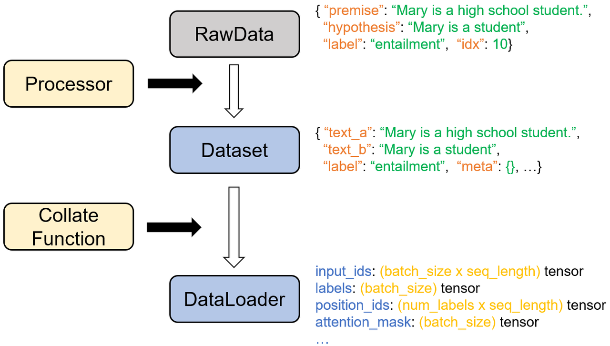

# Datasets

## 数据集处理流程
构建数据集的过程就是NLP的数据预处理过程，其主要目的是将原始的散乱的文件数据重新整理成统一结构的数据，以便语言模型能够直接使用。构建数据集样例的主要流程如下所示（以CommitmentBank数据集为例）：

<div align=center></div>


## 数据集使用代码
```python
import torch.utils.data
from flagai.data.dataset import SuperGlueDataset
from flagai.data.tokenizer import GLMLargeEnWordPieceTokenizer
from tests.test_dataset_new_superglue import CollateArguments
from flagai.data.dataset import ConstructSuperglueStrategy

# 得到默认参数
cl_args = CollateArguments()

# 创建分词器
tokenizer = GLMLargeEnWordPieceTokenizer()
            
# 得到Dataset
dataset = SuperGlueDataset(task_name='cb',
                           data_dir='./datasets/',
                           dataset_type='train',
                           tokenizer=tokenizer)

# 构建collate function
collate_fn = ConstructSuperglueStrategy(cl_args, tokenizer, task_name="rte")

# 创建加载器
loader = torch.utils.data.DataLoader(dataset,
                                    batch_size=1,
                                    shuffle=False,
                                    num_workers=1,
                                    drop_last=False,
                                    pin_memory=False,
                                    collate_fn=collate_fn)
```

## 加载数据文件
FlagAI目前支持自动加载下列数据集：

| 数据集名称                                     | 数据集简称    | 语言   | 所属评测基准   |
|----------------------------------------------|----------|------|----------|
| Broadcoverage Diagnostics                    | boolq    | 英文   | SuperGLUE |
| CommitmentBank                               | cb       | 英文   | SuperGLUE |
| Choice of Plausible Alternatives             | copa     | 英文   | SuperGLUE |
| Multi-Sentence Reading Comprehension         | muiltirc | 英文   | SuperGLUE |
| Recognizing Textual Entailment               | rte      | 英文   | SuperGLUE |
| Words in Context                             | wic      | 英文   | SuperGLUE |                                                   
| The Winograd Schema Challenge                | wsc      | 英文   | SuperGLUE |
| Ant Financial Question Matching Corpus       | afqmc    | 中文   | CLUE     |
| Short Text Classificaiton for News           | tnews    | 中文   | CLUE     |
| Reading Comprehension for Simplified Chinese | cmrc     | 中文   | CLUE     |

只需将`SuperGlueDataset`里的`task_name`参数改成对应数据集的简称即可自动下载。数据集会被默认下载到根目录下的`/dataset`目录下，不过数据集保存目录可以通过更改`data_dir`参数来修改。

下载好的数据集目录下会包含三个文件，对应训练集数据，验证集数据，以及测试集数据, 以CommitmentBank数据集为例，目录下的`train.jsonl`对应训练集，`val.jsonl`对应验证集，`test.jsonl`对应测试集。一般来说训练集和测试集会包含标签信息，而测试集则没有。这些数据文件在接下来的流程中会分开处理。

## 读取文件
不同的数据集可能会有不同的文件格式，以及不同的数据结构。以CommitmentBank数据集为例，下面是其中的一个样例

<div align=center></div>

可以看到，其包含了四个部分,如下所示：

| 键值        | 含义                                                    | 值                              |
|-----------|-------------------------------------------------------|--------------------------------|
| premise   | 前提文本                                                  | Mary is a high school student. |
| hypothesis | 假设文本                                                  | Mary is a student              |
| label     | 代表前提和假设关系的标签<br/>包含entailment,neutral和contradiction三种 | entailment                     |
| idx       | 样例在数据集里的序号                                            | 10                             |

目前所有FlagAI支持数据集的具体结构可以在[这里]()查看。

## 整理成统一的数据结构
在这一步里，我们会统一不同数据集的数据结构，以方便接下来处理。此结构的细节如下：

| 键值     | 含义                                                    | 数据格式 |
|--------|-------------------------------------------------------|------|
| guid   | a unique textual identifier                                                  | str  |
| text_a | the sequence of text                                                  | str  |
| text_b | an optional, second sequence of text | str  |
| label  | an optional label                                            | str  |
| logits | an optional list of per-class logits                                              | list |
| meta   | an optional dictionary to store arbitrary meta information                        | dict |
| ids    | an optional numeric index                                                    | int  |

需要注意的是如果因为数据结构太复杂，导致`text_a`和`text_b`无法塞下背景文本信息的话，可以把剩下的信息放在`meta`里

## 构建完型填空问题
一个完形填空样式包含了背景文本，空位，以及在提供给空位的选项。模型需要找到正确的选项，并填进空位里。

对于每个不同的任务，我们都需要构建不同构造的完型填空问题来让模型回答，以CommitmentBank数据集为例, 其考量的是能否由前提推导出假设, 而有且仅有三种结果：contradiction/neutral/entailment。那么我们可以构建如下的完型填空问题， 其中contradiction/neutral/entailment分别对应true/false/neither

<div align=center></div> 

可以看到，大体上可以分成两步：第一步是组合已有的文本，使其看上去符合完形填空格式；第二步是将原始的标签文本转化为新的标签，作为可能会填入空位的选项。

## 词元化并构造输入样例

接下来，我们需要构造模型的输入，第一步是词元化这些文本，而接下来则需要分成两种情况：

第一种情况下，数据集包含的标签类别是有限的，比如CommitmentBank数据集里只会存在entailment/contradiction/neutral三种标签文本，这种情况我们称为单词(single-token)，常见于分类任务。第二类情况里每一段完型填空都会给出不同的选项(一般是一段长文本)。比如在一些阅读理解数据集里，每一个选项都是一段对于文本的理解，这种情况我们称为多词(multi-token)。这两类情况的处理方法如下所示:

### 1. 单词（single-token）

| 键值                                          | 维度                                   | 含义         | 构造方法                                          |
|---------------------------------------------|--------------------------------------|------------|-----------------------------------------------|
| input_ids                                   | torch.Size([seq_length<sup>1</sup>]) | 输入矩阵       | 由上一步的完形填空文本，加上一些特殊字符<sup>2</sup>组成            |
| labels                                      | labels: torch.Size([1])              | 标签         | 对应的数字标签，比如0,1,2...                            |
| position_ids                                | torch.Size([2， seq_length])          | 位置编码         | 参考[GLM流程]()，第一行代表token的绝对位置，第二行代表遮挡部分的相对位置    |
| attention_mask                              | torch.Size([1])                      | 分隔符位置         |                                               |
| target_ids                                  | torch.Size([num_labels<sup>3</sup>]) | 全量标签列表     | 将所有标签文本分别对应单token的标签，然后将这些标签的序号依次放入target_ids |
| logit_mask                                  | torch.Size([seq_length])             | 对应的文本是否为回答 | 对于每个token, 如果是回答，则对应的地方为1，否则为0                |                                                   


<sup>1</sup>: seq_length代表规定的每个输入向量的最大长度

<sup>2</sup>: 特殊字符添加流程：在句首添加[CLS]符号，句尾添加[EOS]符号，直到长度达到seq_length, 如果完形填空输出的文本有两段，则在中间添加[SEP]符号
<div align=center></div>

<sup>3</sup>: num_labels代表完形填空问题中选项的个数

### 2. 多词（multi-token）

| 键值                                          | 维度                                      | 含义         | 区别                                               |
|---------------------------------------------|-----------------------------------------|------------|----------------------------------------------------|
| input_ids                                   | torch.Size([num_labels, seq_length])    | 输入矩阵       | 将对应的文本拷贝num_labels份                 |
| labels                                      | labels: torch.Size([1])                 | 标签         |                                  |
| position_ids                                | torch.Size([num_labels, 2， seq_length]) | 位置编码       | 将原本的位置编码拷贝num_labels份 |
| attention_mask                              | torch.Size([num_labels])                | 分隔符位置      |      拷贝num_labels份                                              |
| target_ids                                  | torch.Size([num_labels, seq_length])    | 每个选项信息     | 矩阵的每一列代表每一个选项，每一行代表当前选项对应的文本      |
| logit_mask                                  | torch.Size([num_labels, seq_length])    | 对应的文本是否为回答 | 拷贝num_labels份                     |                                                   


## 创建加载器
最后将数据放入PyTorch加载器即可。


## 自定义数据集
对于每一份新的数据集，如果想用prompt-learning的话，一般来说都需要重新构建一份processor和pvp文件，方法如下：


1. 在`flagai/data/dataset/superglue/control.py`文件中, 如下所示创建自定义的processor和pvp函数， 然后把他们与自定义dataset的名字的映射关系添加到control.py里的PROCESSOR_DICT和PVPS两个字典里.

2. 参考如下的示例，构建新的Processor以及PVP函数。
```python
class ExampleProcessor(DataProcessor):

    def get_train_examples(self, data_dir):
        # Assign the filename of train set
        return self._create_examples(os.path.join(data_dir, "train.tsv"), "train")

    def get_dev_examples(self, data_dir, for_train=False):
        # Assign the filename of dev set
        return self._create_examples(os.path.join(data_dir, "dev.tsv"), "dev")

    def get_test_examples(self, data_dir) -> List[InputExample]:
        # Assign the filename of test set
        return self._create_examples(os.path.join(data_dir, "test.tsv"), "test")

    def get_labels(self):
        # Return all label categories
        return ["0", "1"]

    @staticmethod
    def _create_examples(path: str, set_type: str) -> List[InputExample]:
        """
        InputExample包含下列信息
        text_a (str, required): 文本1
        text_b (str, optional): 文本2
        label (str, required): 标签
        guid (str, required): 每一个InputExample的唯一序号
        """
        examples = []
        df = read_tsv(path)

        for idx, row in df.iterrows():
            guid = f"{set_type}-{idx}"
            text_a = punctuation_standardization(row['sentence'])
            label = row.get('label', None)
            example = InputExample(guid=guid, text_a=text_a, label=label)
            examples.append(example)
        return examples


class ExamplePVP(PVP):
    # 把标签映射到对应的含义文本上
    VERBALIZER = {"0": ["中立"],
                    "1": ["利好"],
                    "2": ["利空"]}

    @staticmethod
    def available_patterns():
        # 输出所有可用的模板
        return [0]

    @property
    def is_multi_token(self):
        # 如果标签包含大于一个token，就输出True
        return True

    def get_parts(self, example: InputExample) -> FilledPattern:
        # 把InputExample里面的元素通过设计组合成一个完形填空模板
        text_a= self.shortenable(example.text_a)
        if self.pattern_id == 0:
            return ["标题：", text_a, "类别：", [self.mask]], []
        else:
            raise NotImplementedError("No pattern implemented for id {}".format(self.pattern_id))

    def verbalize(self, label) -> List[str]:
        if self.pattern_id == 0:
            return WankePVP.VERBALIZER_A[label]
        else:
            raise NotImplementedError
```
关于为什么要建立processor和pvp， 以及具体怎么设计样例可以参考 [这里](APPENDIX_TASK.md).

