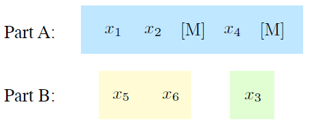
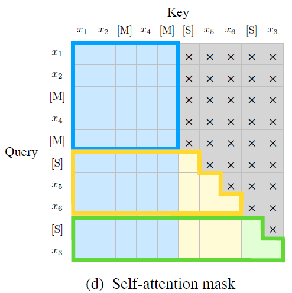

# GLM I/O

a) The original text contains 6 tokens, and the two spans are masked: first span contains the 3rd token and the second span contains the 5th and 6th token.

b) Divide the input into 2 parts, part A (corrupted text) and part B (masked spans). The order of spans is shuffled here.

c) Input and output of GLM, the input includes tokens and 2 positional encodings

d) The self-attention mask that realizes both autoencoding upon corrupted text and autoregressive upon the masked spans

