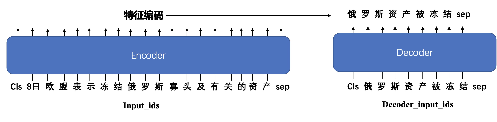

# T5 title generation

## Background
Title-generation task aims to generate title for the given input text.




## Results show

#### Input text
```
"本文总结了十个可穿戴产品的设计原则而这些原则同样也是笔者认为是这个行业最吸引人的地方1为人们解决重复性问题2从人开始而不是从机器开始3要引起注意但不要刻意4提升用户能力而不是取代人",
"2007年乔布斯向人们展示iPhone并宣称它将会改变世界还有人认为他在夸大其词然而在8年后以iPhone为代表的触屏智能手机已经席卷全球各个角落未来智能手机将会成为真正的个人电脑为人类发展做出更大的贡献",
"雅虎发布2014年第四季度财报并推出了免税方式剥离其持有的阿里巴巴集团15％股权的计划打算将这一价值约400亿美元的宝贵投资分配给股东截止发稿前雅虎股价上涨了大约7％至5145美元"
```
#### Out title
```
可 穿 戴 产 品 设 计 原 则 十 大 原 则
乔 布 斯 宣 布 iphone 8 年 后 将 成 为 个 人 电 脑
雅 虎 拟 剥 离 阿 里 巴 巴 15 ％ 股 权
```
## Usage

### 1.Load data
The sample data is in `/examples/bert_title_generation/data/`

You need to define the data loading process in train.py. For example:
```python
def read_file():
    src = []
    tgt = []

    ## read data file to load src and tgt, for example:
    ## src = ["article_1", "article_2", "article_3" ......]
    ## tgt = ["title_1", "title_2", "title_3" ......]
    ## no matter what data you use, you need to construct the right src and tgt.
    with open(src_dir, 'r', encoding='utf-8') as f:
        lines = f.readlines()
        for line in lines:
            src.append(line.strip('\n').lower())

    with open(tgt_dir, 'r', encoding='utf-8') as f:
        lines = f.readlines()
        for line in lines:
            tgt.append(line.strip('\n').lower())
    return src,tgt
```

### 2.Load model and tokenizer

```python
from flagai.auto_model.auto_loader import AutoLoader

loader = AutoLoader("seq2seq", "T5-base-ch", model_dir="./state_dict/")
model = loader.get_model()
tokenizer = loader.get_tokenizer()
```

### 3. Train
Then input this code in commandline to train:
```commandline
python ./train.py
```
The configuration support multi-gpus training.
Modify the training configuration by this code:
```python
from flagai.trainer import Trainer
trainer = Trainer(
    env_type="deepspeed",
    experiment_name="t5_seq2seq",
    batch_size=1,
    gradient_accumulation_steps=1,
    lr=2e-4,
    weight_decay=1e-3,
    epochs=10,
    log_interval=10,
    eval_interval=10000,
    load_dir=None,
    save_dir="checkpoints",
    save_interval=1,
    num_checkpoints=1,
    master_ip='127.0.0.1',
    master_port=17750,
    num_nodes=1,
    num_gpus=2,
    hostfile='./hostfile',
    deepspeed_config='./deepspeed.json',
    training_script=__file__,
)
```
Divide the training set validation set and create the dataset:
```python
sents_src, sents_tgt = read_file()
data_len = len(sents_tgt)
train_size = int(data_len * 0.8)
train_src = sents_src[:train_size][:2000]
train_tgt = sents_tgt[:train_size][:2000]

val_src = sents_src[train_size:]
val_tgt = sents_tgt[train_size:]

train_dataset = T5Seq2seqDataset(train_src,
                                 train_tgt,
                                 tokenizer=tokenizer,
                                 max_src_length=300,
                                 max_tgt_length=200)
val_dataset = T5Seq2seqDataset(val_src,
                               val_tgt,
                               tokenizer=tokenizer,
                               max_src_length=300,
                               max_tgt_length=200)

trainer.train(model, train_dataset=train_dataset, valid_dataset=val_dataset)
```

### Generation
If you have already trained a model, in order to see the results more intuitively, rather than the loss of the validation set.
You can run the generation file.
First to modify the path of saved model.
```python
model_save_path = "./checkpoints/1001/mp_rank_00_model_states.pt" ## 1001 is example, you need modify the number.
```
```commandline
python ./generate.py
```
Then you can see the generation result.

