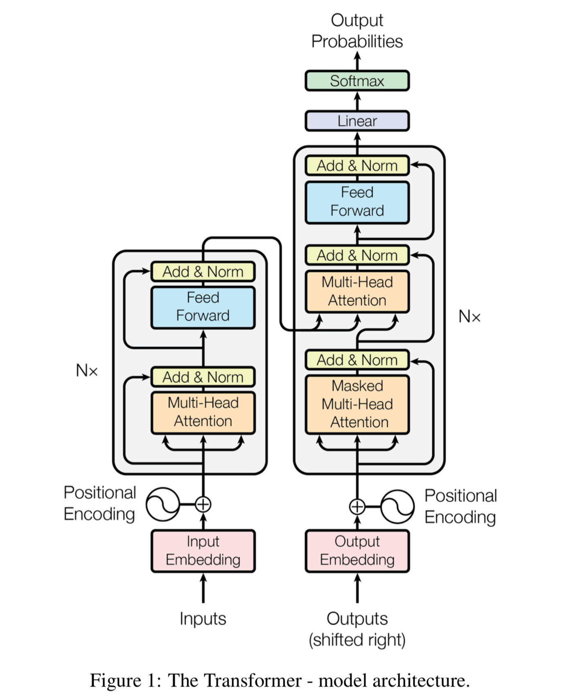

## Transformer basics
Briefly, the Transformer, as proposed in [Attention Is All You Need](https://arxiv.org/abs/1706.03762),
can be regarded as an integration of an encoder block and a decoder block. With the use of attention mechanism,
Transformer can extract better features from input, and consequently Transformer-based models have achieved state-of-the-art
performance in most of the language tasks. Another feature of transformer is its compatibility with parallel computing, which is a major
superiority compared with sequential models like RNN.

The Transformer architecture is shown below

In the encoder step, firstly the embedding encoded from token positions is added to embeddings encoded from tokens themselves.
Then the input embeddings are passed to a multi-head attention mechanism, which is able to take mutual information among tokens into consideration.
The computed output will add the original input embeddings, followed by a layer normalization.
The rest of the encoder part is a feed-forward layer with addition and a layer normalization.

The decoder architecture is similar to the encoder, with the following differences:

1. At the beginning, we need to mask future information for decoders, which is done by setting the upper triangle of the matrix to 0.
2. There is a middle layer that incorporates query and key from encoder, and value from decoder.
3. The decoder has a linear layer and softmax layer at the end to determine output probability for each token in the vocabulary

N encoders and decoders will be stacked together to form a transformer, where N is usually selected as 12 or 24.

Step-by-step details of transformers can be viewed in [this article](https://towardsdatascience.com/illustrated-guide-to-transformers-step-by-step-explanation-f74876522bc0).

## Transformer Applications

Currently, there exist several different pre-training model architectures: autoencoding models that only implement encoder architecture (e.g., BERT),
autoregressive models that only implement decoder (e.g., GPT), and encoder-decoder models that implement both encoder and decoder (e.g., T5).

The **GLM model**, proposed in [All NLP Tasks Are Generation Tasks: A General Pretraining Framework](https://arxiv.org/abs/2103.10360),
claims to have good performance in classification, unconditional generation, and conditional generation tasks with the use of a new pre-training method.

The key features of GLM include:

- First task: Several spans of the text are masked following the idea of autoencoding. Those spans will be randomly rearranged and be predicted in an autoregressive manner. The masked spans covers 15% original tokens.
- Second task: Similar to the first task, but the span covers 50%-100% original tokens.
- Other model architecture changes compared with BERT
  - [Pre-LN](http://proceedings.mlr.press/v119/xiong20b.html)
  - 2D positional encoding: Each token has two positional encodings: the global position in the sentence, and the local position inside the masked span.
  - Feed-forward network is replaced with a linear layer

An example showing the autoencoding and autoregressive of GLM can be viewed [here](APPENDIX_GLM_IO.md).

