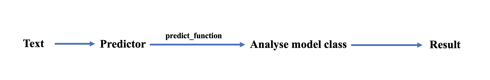

## Predictor

### Call a line of code through Predictor to get the ideal prediction result

For different tasks, such as title generation, named entity recognition, text classification, etc., the way of prediction varies. At the same time, for different models, such as encoder, decoder, and encoder-decoder models, the prediction methods are also different.

Predictor integrates different tasks and prediction codes of different models. The text is passed in through Pipline. Predictor will quickly parse the model type, call different prediction codes, and get the prediction results of the corresponding model.



Taking the gpt2 article continuation task as an example, the random sampling generation method is adopted:

```python
>>> from flagai.auto_model.auto_loader import AutoLoader
>>> from flagai.model.predictor.predictor import Predictor
>>> import torch 
>>> if __name__ == '__main__':
>>>     device = torch.device("cuda" if torch.cuda.is_available() else "cpu")

>>>     ## load model and tokenizer by the Autoloader
>>>     loader = AutoLoader(task_name="writing", 
>>>                         model_name="GPT2-base-ch")
>>>     model = loader.get_model()
>>>     tokenizer = loader.get_tokenizer()
>>>     model.to(device)
>>>     ## define predictor
>>>     predictor = Predictor(model, tokenizer)
>>>     ## define the input
>>>     text = "今天天气不错，"
>>>     ## analyse the model class and to generate
>>>     out = predictor.predict_generate_randomsample(text,  ## input
>>>                                                   input_max_length=512,  ## max in length
>>>                                                   out_max_length=100, ## max out length
>>>                                                   repetition_penalty=1.5, ## avoid output repeated. (https://arxiv.org/pdf/1909.05858.pdf)
>>>                                                   top_k=20,  ## top k
>>>                                                   top_p=0.8) ## (http://arxiv.org/abs/1904.09751)
>>> 
>>>     print(f"out is {out}")
>>>     ### out is  到这里来看了一下，很是兴奋，就和朋友一起来这里来了。我们是周五晚上去的，人不多，所以没有排队，而且这里的环境真的很好，在这里享受美食真的很舒服，我们点了一个套餐，两个人吃刚刚好，味道很好。
```
Predictor can automatically analyze that the model type is GPT2, and automatically call the generation method corresponding to the GPT2 model to obtain the prediction result.

In addition to the ``writing`` task, Predictor also supports the prediction of ```title-generation```, ``ner``, ``semantic-matching`` and other tasks. For example the ner task:

```python
>>> import torch
>>> from flagai.auto_model.auto_loader import AutoLoader
>>> from flagai.model.predictor.predictor import Predictor
>>> device = torch.device("cuda" if torch.cuda.is_available() else "cpu")

>>> target = ["O", "B-LOC", "I-LOC", "B-ORG", "I-ORG", "B-PER", "I-PER"]
>>> auto_loader = AutoLoader(task_name="ner",
>>>                          model_name="RoBERTa-base-ch-ner", # Load the checkpoints from Modelhub(model.baai.ac.cn/models)
>>>                          class_num=len(target))

>>> model = auto_loader.get_model()
>>> tokenizer = auto_loader.get_tokenizer()
>>> model.to(device)

>>> predictor = Predictor(model, tokenizer)

>>> test_data = [
>>>     "6月15日，河南省文物考古研究所曹操高陵文物队公开发表声明承认：“从来没有说过出土的珠子是墓主人的",
>>>     "4月8日，北京冬奥会、冬残奥会总结表彰大会在人民大会堂隆重举行。习近平总书记出席大会并发表重要讲话。在讲话中，总书记充分肯定了北京冬奥会、冬残奥会取得的优异成绩，全面回顾了7年筹办备赛的不凡历程，深入总结了筹备举办北京冬奥会、冬残奥会的宝贵经验，深刻阐释了北京冬奥精神，对运用好冬奥遗产推动高质量发展提出明确要求。",
>>>     "当地时间8日，欧盟委员会表示，欧盟各成员国政府现已冻结共计约300亿欧元与俄罗斯寡头及其他被制裁的俄方人员有关的资产。",
>>>     "这一盘口状态下英国必发公司亚洲盘交易数据显示博洛尼亚热。而从欧赔投注看，也是主队热。巴勒莫两连败，",
>>> ]

>>> for t in test_data:
>>>     entities = predictor.predict_ner(t, target, maxlen=256)
>>>     result = {}
>>>     for e in entities:
>>>         if e[2] not in result:
>>>             result[e[2]] = [t[e[0]:e[1] + 1]]
>>>         else:
>>>             result[e[2]].append(t[e[0]:e[1] + 1])
>>>     print(f"result is {result}")
```
By passing in a line of text, you can quickly get the corresponding named entity recognition task results, and the ``predict_ner`` interface adapts to all models that support ner tasks, such as BERT, Roberta, BERT-CRF, BERT-GlobalPointer, Roberta-CRF, Roberta -GlobalPointer and so on.


### Perdictor所有支持的方法
#### Text embedding
1. predict_embedding: Enter a text to get the embedding representation, supports models such as bert, roberta, etc.
#### Text classification, semantic matching
1. predict_cls_classifier: Input text or text pairs to get multi-classification results, and support transformer encoder models such as bert and roberta.
#### Mask LM
1. predict_masklm: Enter the text marked with [MASK] to get the original result, support transformer encoder models such as bert and roberta.
#### NER
1. predict_ner: Input text to get ner results, support transformer encoder models such as bert and roberta.
#### Generation
1. predict_generate_beamsearch: The input text gets the output text, which belongs to the seq2seq task. Supports bert, roberta, gpt2, t5 and glm models.
2. predict_generate_randomsample: The input text gets the output text, which belongs to the seq2seq task. Supports bert, roberta, gpt2, t5 and glm models.

### Method call description
As long as the model used supports the corresponding method of Predictor, it can be directly predicted, for example: the model is GLM, T5, GPT2, because different generation methods can be called directly, but other prediction methods such as text classification and named entity recognition cannot be called.

Bert and Roberta models support many methods and can call all the methods shown in the previous section.