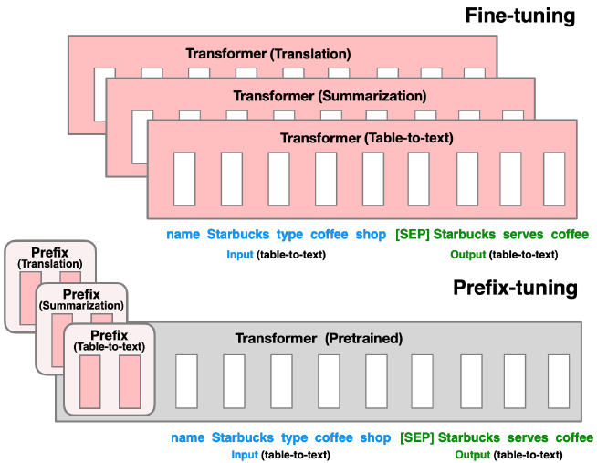

# Introduction to Prompt Learning

## Background
Prompt-learning has been a widely-used paradigm in the field of Natural Language Processing (NLP), especially when data is limited. It follows the idea of pretraining-finetuning paradigm, where pre-trained language models (PLMs) will be adapted to various downstream tasks. Instead of  adding task-specific objectives in finetuning,  prompt-learning converts each original task to a specific prompting function. This process is named prompt engineering.

## Prompt Engineering
Their are two main approaches in prompt engineering: cloze prompts and prefix prompts.  Cloze prompts are more suitable in downstream tasks using masked LMs, while prefix prompts are generally used in text generation tasks.

### Cloze Prompts
Generally, the input texts and labels can be obtained from the task dataset. These data will be rearranged into a cloze-style phrase, which includes two steps: 
1. Applying a template which consists of an input slot, an answer slot, and self-defined natural language texts
2. Applying a verbalizer that maps the original labels to answers for the answer slot.

Here is an example for cloze promts:

As shown in the following example, the dataset contains two input texts: premise and hypothesis. The label indicates the relationship between premise and hypothesis, and there are three possible text strings for label: entailment, contradiction and neutral. 

<div align=center></div>

We can design a meaningful cloze template as below

<div align=center></div>

And we can implement the template through the following code:

```python
def get_parts(self, example: InputExample):  
    '''A simplified version of the actual code'''
    # Construct the template
    cloze_ids = [
        example.text_a,' question: is it true, false or neither that',
         example.text_b, ' answer:', [self.mask]]
    return cloze_ids
```

The label in various datasets can have multiple types including boolean, integer and string. We need to implement a verbalizer that maps the labels to the text string of choices in cloze question. For example, here the 'entailment', 'contradiction' and 'neutral' labels can be mapped to 'true' ,'false' and 'neither', and each time the answer to be filled is always selected among those choices. 
Verbalizer is essentially a mapping relationship, and we can define it in a Python dictionary as shown below:

```python
VERBALIZER = {
    "contradiction": [" false"],
    "entailment": [" true"],
    "neutral": [" neither"]
}
def verbalize(self, label) -> List[str]:
    return CbPVP.VERBALIZER[label]
```

### Prefix Prompts
Instead of designing a prompt in real natural language, prefix prompts directly modifies the embedding space. It inserts a sequence of task-specific vectors and freezes the LM parameters. An advantage of prefix prompts is that embeddings of templates are no longer limited by parameters in pre-trained LMs. 

Here is an example that compares prefix tuning and fine-tuning in the embedding space of transformers，the grey parts of the transformer are frozen during prefix tuning:

<div align=center></div>


## Reference
[Pre-train, Prompt, and Predict: A Systematic Survey of Prompting Methods in Natural Language Processing](https://arxiv.org/abs/2107.13586)

[OpenPrompt: An Open-source Framework for Prompt-learning](https://arxiv.org/abs/2111.01998)

[Exploiting Cloze Questions for Few Shot Text Classification and Natural Language Inference](https://arxiv.org/abs/2001.07676)

[Prefix-Tuning: Optimizing Continuous Prompts for Generation](https://arxiv.org/abs/2101.00190)