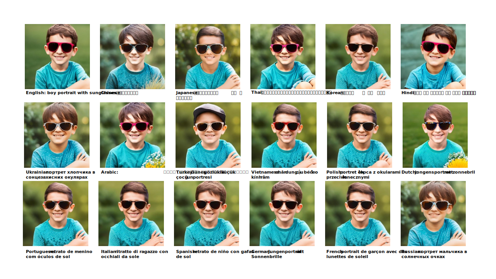
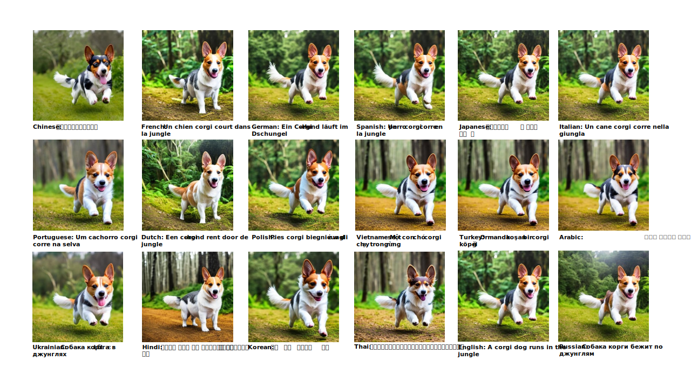
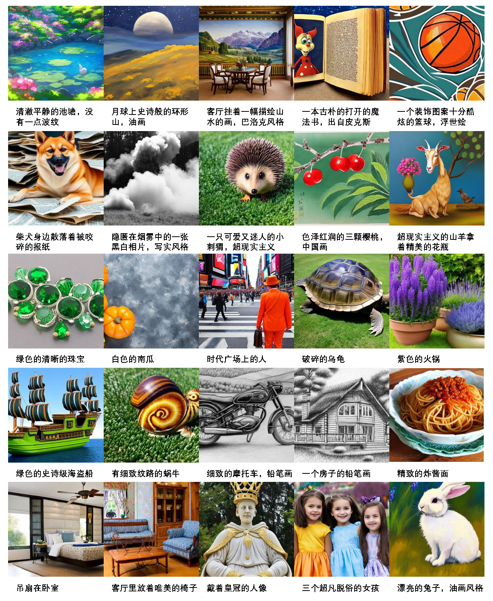
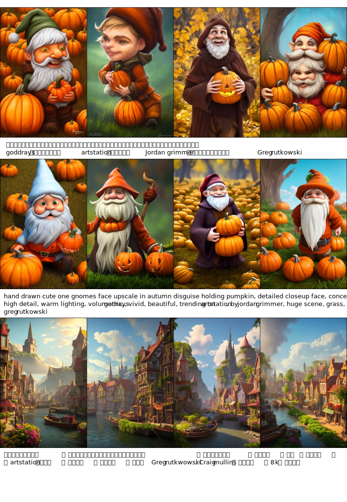
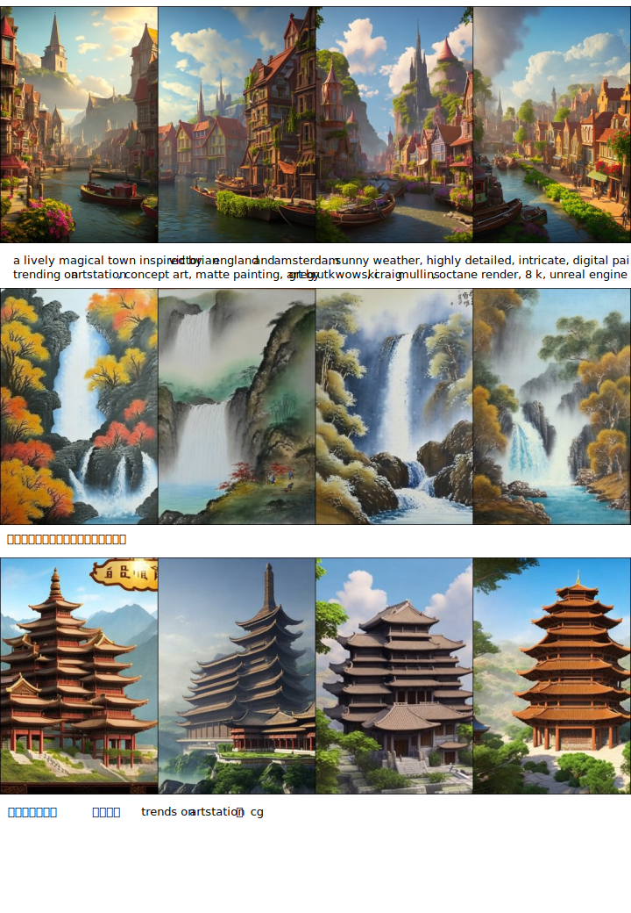

# AltDiffusion

|  名称 Name   | 任务 Task       |   语言 Language(s)    | 模型 Model    | Github |
|:----------:| :----:  |:-------------------:| :----:  |:------:|
| AltDiffusion-m18 | 多模态 Multimodal | Multilingual | Stable Diffusion |   [FlagAI](https://github.com/FlagAI-Open/FlagAI)   |

## 模型信息
AltDiffusion-m18 是一种基于@StableDiffusion 的多语言文本图像生成模型。该模型由 Stability AI 和@BAAI FlagAI 团队合作完成（FlagAI 是 LF AI & Data Foundation 的沙盒阶段项目）。AltDiffusion-m18目前支持 18 种语言，包含：英语、中文、日语、泰语、韩语、印地语、乌克兰语、阿拉伯语、土耳其语、越南语、波兰语、荷兰语、葡萄牙语、意大利语、西班牙语、德语、法语和俄语。

AltDiffusion-m18 is a multilingual text-image generation model built on @StableDiffusion. This model is a collaboration between Stability AI & @BAAI FlagAI team (FlagAI is a sandbox-stage project of LF AI & Data Foundation). AltDiffusion-m18 currently supports 18 languages, including English, Chinese, Japanese, Thai, Korean, Hindi, Ukrainian, Arabic, Turkish, Vietnamese, Polish, Dutch, Portuguese, Italian, Spanish, German, French, and Russian.

###  训练方法
如图1，所示训练分为两个阶段：概念对齐阶段和效果提升阶段。我们首先替换使用多语言CLIP AltCLIP-m18替换掉原始SD的OpenCLIP, 之后冻住AltCLIP的参数。在第一阶段中，使用256\*256的图片分辨率，训练Unet中CrossAttention层的k,v矩阵进行文图的概念对齐。在第二阶段中，使用512\*512的图片分辨率，训练Unet的所有参数进行生成效果的提升。

As shown in Figure 1, the training process consists of two stages: concept alignment and quality improvement. We first replaced the original OpenCLIP in SD with the multilingual CLIP AltCLIP-m18 and froze its parameters. In the first stage, we trained the k,v matrices in the CrossAttention layer of the Unet model to align the concepts between text and image using 256\*256 image resolution. In the second stage, we trained all the parameters in the Unet model to improve the generation performance using 512\*512 image resolution.

图1： AltDiffusion示意图 (Fig.1: illustrate for AltDiffusion)

### 数据使用
在第一阶段中，我们使用[LAION 5B](https://laion.ai/blog/laion-5b/)中的LAION 5B-en(2.32B) 和 过滤的18语言 LAION 5B-multi（1.8B）数据进行训练。在第二阶段中，我们使用[LAION Aesthetics V1](https://laion.ai/blog/laion-aesthetics/)中的LAION Aesthetics V1-en(52M) 和 过滤的18语言 LAION Aesthetics V1-multi(46M)数据进行训练。

In the first stage, we trained the model using LAION 5B-en(2.32B) from [LAION 5B](https://laion.ai/blog/laion-5b/) and filtered LAION 5B-multi(1.8B) data for the 18 languages. In the second stage, we trained the model using LAION Aesthetics V1-en(52M) from [LAION Aesthetics V1](https://laion.ai/blog/laion-aesthetics/) and filtered LAION Aesthetics V1-multi(46M) data for the 18 languages.

### 训练细节
优化器：AdamW 

学习率：1e-4 并带有10k步的warmup

显卡：64 张 NVIDIA A100-SXM4-40GB
第一阶段，从SD v2.1 512-base-ema开始，以batch size 3072在256\*256的分辨率上使用64张A100训练330k步，耗时8天；第二阶段，从第一阶段330k的checkpoint开始，以batch size 3840在512\*512的分辨率上使用64张A100训练270k步，耗时7天。然后，基于270k的checkpoint随机丢掉10%的文本进行150k步的classifier-free guidance训练，耗时4天。

The first stage involved using the SD v2.1 512-base-ema checkpoint to initialize all parameters except for the language model, with a batch size of 3072 and a resolution of 256x256 for training on LAION2B en and LAION2Bmulti for 330k steps over approximately 8 days. In the second stage, training began from the 330k step checkpoint, with a batch size of 3840 on LAION Aesthetics V1-en and V1-multi, and training for 270k steps with a resolution of 512x512, taking around 7 days. Training then continued from the 270k step checkpoint for another 150k steps, with 10% of the text randomly discarded for classifierfree guidance learning, taking approximately 4 days. The teacher model of AltCLIP is OpenCLIP ViT-H-14(version is ”laion2b s32b b79k”). The pretrained Stable Diffusion
checkpoint we used is SD v2.1 512-base-ema. We also use Xformer and Efficient Attention to save memory use and speed up training. The decay of EMA is 0.9999.

## 效果展示

### 18语言效果

### 中文效果

### 长图效果

## 参考

- Stability AI: https://stability.ai/

- FlagAI: https://github.com/FlagAI-Open/FlagAI

- Stable Diffusion: https://huggingface.co/spaces/stabilityai/stable-diffusion
