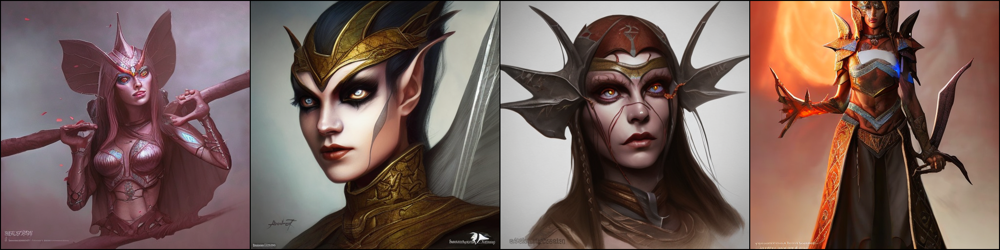
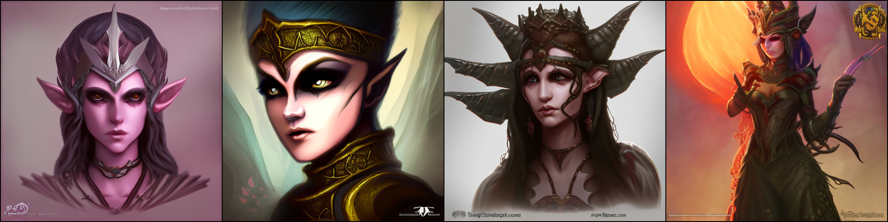
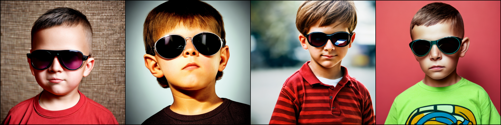
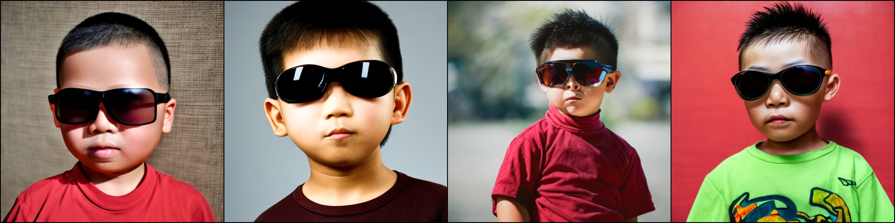
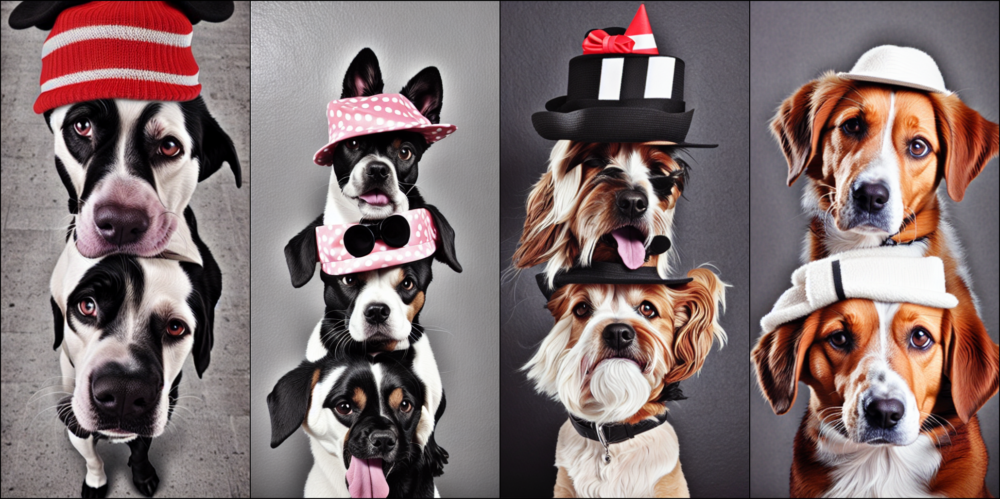
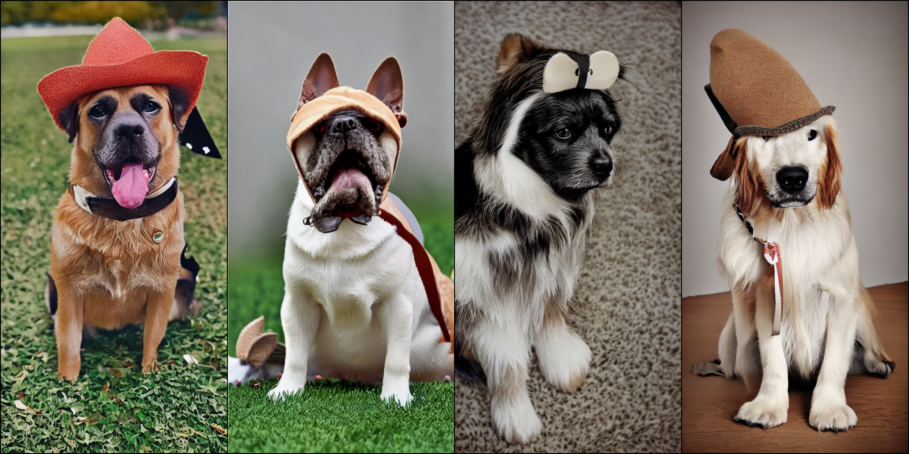

#  模型信息/Model Information

我们使用 [AltCLIP](https://github.com/FlagAI-Open/FlagAI/tree/master/examples/AltCLIP/README.md) 作为text encoder，基于 [Stable Diffusion](https://huggingface.co/CompVis/stable-diffusion) 训练了双语Diffusion模型，训练数据来自 [WuDao数据集](https://data.baai.ac.cn/details/WuDaoCorporaText) 和 [LAION](https://huggingface.co/datasets/laion/laion2B-en) 。

我们的版本在中英文对齐方面表现非常出色，是目前市面上开源的最强版本，保留了原版stable diffusion的大部分能力，并且在某些例子上比有着比原版模型更出色的能力。

AltDiffusion 模型由名为 AltCLIP 的双语 CLIP 模型支持，该模型也可在本项目中访问。您可以阅读 [此教程](https://github.com/FlagAI-Open/FlagAI/tree/master/examples/AltCLIP/README.md) 了解更多信息。


注意：模型推理要求一张至少10G以上的GPU。

同时，AltDiffusion的 web demo 也部署在huggingface spaces上，欢迎试用！网址为：[https://huggingface.co/spaces/BAAI/bilingual_stable_diffusion](https://huggingface.co/spaces/BAAI/bilingual_stable_diffusion)

Our model performs well in aligning Chinese and English, and is the strongest open source version on the market today, retaining most of the stable diffusion capabilities of the original, and in some cases even better than the original model.

We used [AltCLIP](https://github.com/FlagAI-Open/FlagAI/tree/master/examples/AltCLIP/README.md) as the text encoder, and trained a bilingual Diffusion model based on [Stable Diffusion](https://huggingface.co/CompVis/stable-diffusion), with training data from [WuDao dataset](https://data.baai.ac.cn/details/WuDaoCorporaText) and [LAION](https://huggingface.co/datasets/laion/laion2B-en).

AltDiffusion model is backed by a bilingual CLIP model named AltCLIP, which is also accessible in FlagAI. You can read [this tutorial](https://github.com/FlagAI-Open/FlagAI/tree/master/examples/AltCLIP/README.md) for more information. 

Note that the model inference requires a GPU of at least 10G above.

Also, AltDiffusion's web demo is deployed on huggingface spaces, feel free to try it out! The web address is: [https://huggingface.co/spaces/BAAI/bilingual_stable_diffusion](https://huggingface.co/spaces/BAAI/bilingual_stable_diffusion) 

# 模型权重/Model Weights

第一次运行AltDiffusion模型时会自动从 [这里](https://model.baai.ac.cn/model-detail/100076)  下载如下权重,  

The following weights are automatically downloaded from [here](https://model.baai.ac.cn/model-detail/100076) when the AltDiffusion model is run for the first time: 

| 模型名称 Model name              | 大小 Size | 描述 Description                                        |
|------------------------------|---------|-------------------------------------------------------|
| StableDiffusionSafetyChecker | 1.13G   | 图片的安全检查器；Safety checker for image                     |
| AltDiffusion                 | 8.0G    | 我们的双语AltDiffusion模型； Our bilingual AltDiffusion model |
| AltCLIP                      | 3.22G   | 我们的双语AltCLIP模型；Our bilingual AltCLIP model            |


# 示例/Example

以下示例将为文本输入`Anime portrait of natalie portman as an anime girl by stanley artgerm lau, wlop, rossdraws, james jean, andrei riabovitchev, marc simonetti, and sakimichan, trending on artstation` 在目录`./AltDiffusionOutputs`下生成图片结果。

The following example will generate image results for text input `Anime portrait of natalie portman as an anime girl by stanley artgerm lau, wlop, rossdraws, james jean, andrei riabovitchev, marc simonetti, and sakimichan, trending on artstation` under the default output directory `./AltDiffusionOutputs`

```python
import torch
from flagai.auto_model.auto_loader import AutoLoader
from flagai.model.predictor.predictor import Predictor

# Initialize 
prompt = "Anime portrait of natalie portman as an anime girl by stanley artgerm lau, wlop, rossdraws, james jean, andrei riabovitchev, marc simonetti, and sakimichan, trending on artstation"
device = torch.device("cuda" if torch.cuda.is_available() else "cpu")


loader = AutoLoader(task_name="text2img", #contrastive learning
                    model_name="AltDiffusion",
                    model_dir="./checkpoints")

model = loader.get_model()
model.eval()
model.to(device)
predictor = Predictor(model)
predictor.predict_generate_images(prompt)
```

您可以在`predict_generate_images`函数里通过改变参数来调整设置，具体信息如下:

More parameters of predict_generate_images for you to adjust for `predict_generate_images` are listed below:


`prompt: str`: 提示文本; The prompt text

`out_path: str`: 输出路径; The output path to save images

`n_samples: int`: 输出图片数量; Number of images to be generated

`skip_grid: bool`: 如果为True, 会将所有图片拼接在一起，输出一张新的图片; If set to true, image gridding step will be skipped

`ddim_step: int`: DDIM模型的步数; Number of steps in ddim model

`plms: bool`: 如果为True, 则会使用plms模型; If set to true, PLMS Sampler instead of DDIM Sampler will be applied

`scale: float` : 这个值决定了文本在多大程度上影响生成的图片，值越大影响力越强; This value determines how important the prompt incluences generate images

`H: int`: 图片的高度; Height of image

`W: int`: 图片的宽度; Width of image

`C: int`: 图片的channel数; Numeber of channels of generated images

`seed: int`: 随机种子; Random seed number 


# 更多生成结果/More Results

## 中英文对齐能力/Chinese and English alignment ability

### prompt:dark elf princess, highly detailed, d & d, fantasy, highly detailed, digital painting, trending on artstation, concept art, sharp focus, illustration, art by artgerm and greg rutkowski and fuji choko and viktoria gavrilenko and hoang lap
### 英文生成结果/Generated results from English prompts



### prompt:黑暗精灵公主，非常详细，幻想，非常详细，数字绘画，概念艺术，敏锐的焦点，插图
### 中文生成结果/Generated results from Chinese prompts


## 中文表现能力/The performance for Chinese prompts

## prompt:带墨镜的男孩肖像，充满细节，8K高清



## prompt:带墨镜的中国男孩肖像，充满细节，8K高清


## 长图生成能力/The ability to generate long images

### prompt: 一只带着帽子的小狗 
### 原版 stable diffusion：


### Ours:


注: 此处长图生成技术由右脑科技(RightBrain AI)提供。

Note: The long image generation technology here is provided by Right Brain Technology.

# License

该模型通过 [CreativeML Open RAIL-M 许可证]((https://huggingface.co/spaces/CompVis/stable-diffusion-license)) 获得许可。作者对您生成的输出不主张任何权利，您可以自由使用它们并对它们的使用负责，不得违反本许可中的规定。该许可证禁止您分享任何违反任何法律、对他人造成伤害、传播任何可能造成伤害的个人信息、传播错误信息和针对弱势群体的任何内容。您可以出于商业目的修改和使用模型，但必须包含相同使用限制的副本。有关限制的完整列表，请[阅读许可证]((https://huggingface.co/spaces/CompVis/stable-diffusion-license)) 。

The model is licensed with a [CreativeML Open RAIL-M license](https://huggingface.co/spaces/CompVis/stable-diffusion-license). The authors claim no rights on the outputs you generate, you are free to use them and are accountable for their use which must not go against the provisions set in this license. The license forbids you from sharing any content that violates any laws, produce any harm to a person, disseminate any personal information that would be meant for harm, spread misinformation and target vulnerable groups. You can modify and use the model for commercial purposes, but a copy of the same use restrictions must be included. For the full list of restrictions please [read the license](https://huggingface.co/spaces/CompVis/stable-diffusion-license) .