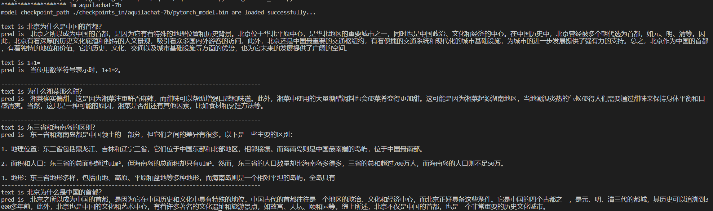

# Aquila

Aquila Language Model is the first open source language model that supports both Chinese and English knowledge, commercial license agreements, and compliance with domestic data regulations.

- 🌟 **Supports open source commercial licenses**. The source code of the Aquila series models is based on the [Apache 2.0 agreement](https://www.apache.org/licenses/LICENSE-2.0), while the model weight is based on the [BAAI Aquila Model License Agreement](../../../BAAI_Aquila_Model_License.pdf). Users can use it for commercial purposes as long as they meet the licensing restrictions.

- ✍️ **Possesses Chinese and English knowledge**. The Aquila series model is trained from scratch on a high-quality corpus of Chinese and English languages, with Chinese corpora accounting for about 40%, ensuring that the model accumulates native Chinese world knowledge during the pre-training phase, rather than translated knowledge.

- 👮‍♀️ **Complies with domestic data regulations**. The Chinese corpora of the Aquila series models come from Intelligence Source's accumulated Chinese datasets over the years, including Chinese internet data from over 10,000 sources (more than 99% of which are domestic sources), as well as high-quality Chinese literature and book data supported by authoritative domestic organizations. We will continue to accumulate high-quality and diverse datasets and incorporate them into the subsequent training of the Aquila base models.

- 🎯 **Continuous improvements and open sourcing**. We will continue to improve training data, optimize training methods, and enhance model performance, cultivate a flourishing "model tree" on a better base model foundation, and continuously update open-source versions.

The additional details of the Aquila model will be presented in the official technical report. Please stay tuned for updates on official channels, including the [FlagAI GitHub repository](https://github.com/FlagAI-Open/FlagAI/), [FlagAI's Zhihu account](https://www.zhihu.com/people/95-22-20-18) and [FlagAI's official technical communication group](https://github.com/FlagAI-Open/FlagAI/blob/master/wechat-qrcode.jpg).


| Model              | Model Type               | Description                                                                                                                                                                                                                                                                                                                                                                                                     | File Path                                                                                                   | Standalone Model Download                                 | Status         | GPUs Used    |
| :----------------- | :----------------------- | :------------------------------------------------------------------------------------------------------------------------------------------------------------------------------------------------------------------------------------------------------------------------------------------------------------------------------------------------ | :--------------------------------------------------------------------------------------------------------- | :-------------------------------------------------------- | :--------------| :----------- | 
| Aquila-7B          | Base model, 7 billion parameters   | **Aquila Base Model** inherits the architectural design advantages of GPT-3 and LLaMA. It replaces a batch of more efficient underlying operator implementations, redesigns the implementation of bilingual tokenizer, upgrades BMTrain parallel training method, and achieves nearly 8 times the training efficiency of Magtron+DeepSpeed ZeRO-2.                                   | [./examples/Aquila/Aquila-pretrain](https://github.com/FlagAI-Open/FlagAI/tree/master/examples/Aquila/Aquila-pretrain) | [Download Aquila-7B](http://model.baai.ac.cn/model-detail/100098) | Released       | Nvidia-A100   |
| Aquila-33B         | Base model, 33 billion parameters   | Same as above                                                                                                                                                                                                                                                                                                                                                                                                   | ——                                                                                                          | Coming soon                                               | Nvidia-A100   |
| AquilaChat-7B      | SFT model, fine-tuned and RL based on Aquila-7B  | **AquilaChat Dialog Model** supports fluent text dialogue and multiple language generation tasks, and realizes the call of AquilaChat to other models and tools by defining an expandable special instruction specification, which is easy to extend. For example, calling the open source **[AltDiffusion](https://github.com/FlagAI-Open/FlagAI/tree/master/examples/AltDiffusion-m18) multimodal language image generation model** of Flagship Intelligence achieved smooth image generation capability. Together with Flagship Intelligence's **InstructFace multi-step controllable text-picture model**, it is easy to achieve multi-step controllable editing of human face images. | [./examples/Aquila/Aquila-chat](https://github.com/FlagAI-Open/FlagAI/tree/master/examples/Aquila/Aquila-chat) | [Download AquilaChat-7B](https://model.baai.ac.cn/model-detail/100101) | Released    | Nvidia-A100   |
| AquilaChat-33B     | SFT model, fine-tuned and RL based on Aquila-33B  | Same as above                                                                                                                                                                                                                                                                                                                                                                                                   | ——                                                                                                          | Coming soon                                               | Nvidia-A100   |
| AquilaCode-7B-NV   | Base model, "text-code" generation model, further pre-trained based on Aquila-7B, trained on Nvidia  | AquilaCode-7B achieves high performance with small data sets and parameters, and is currently the best open source code model that supports both Chinese and English, trained using training code data with compliant open source licenses after high-quality filtering. AquilaCode-7B has been trained on both Nvidia and domestic chips for code models. | [./examples/Aquila/Aquila-code](https://github.com/FlagAI-Open/FlagAI/tree/master/examples/Aquila/Aquila-code) | [Download AquilaCode-7B-NV](https://model.baai.ac.cn/model-detail/100102) | Released | Nvidia-A100  |
| AquilaCode-7B-TS   | Base model, "text-code" generation model, further pre-trained based on Aquila-7B, trained on Horizon Robotics chips | Same as above                                                                                                                                                                                                                                                                                                                                                                                                             | [./examples/Aquila/Aquila-code](https://github.com/FlagAI-Open/FlagAI/tree/master/examples/Aquila/Aquila-code) | [Download AquilaCode-7B-TS](https://model.baai.ac.cn/model-detail/100099)  | Released        | Tianshu-BI-V100 |


 <br>If you have any question, please refer to the [FAQ](https://github.com/FlagAI-Open/FlagAI/issues/371) first. If you cannot solve them, please submit an [issue](https://github.com/FlagAI-Open/FlagAI/issues) directly.


<!-- </table>  -->

## Quick Start  AquilaChat-7B（Chat model）

### Basic Model Environment Setup

1. Clone the FlagAI Github repository locally by running the following command:
   
    ```
    git clone https://github.com/FlagAI-Open/FlagAI.git
    ```

2. Navigate to the repository and install FlagAI from source code.
   
    ```
    cd FlagAI
    python setup.py install
    ```
    注：我们目前支持在Ubuntu, Mac和Mac上运行，详细环境依赖信息可参考[FlagAI环境安装](../../../README.md#requirements-and-installation)

3. Navigate to the **AquilaChat-7B Chat Model** directory.
    ```
    cd examples/Aquila/Aquila-chat
    ```

For the Aquila-7B model, we provide two ways of use: **model inference** and **fine-tuning**.

### Chat Model Inference

Normal model inference (which consumes approximately 14.6GB of GPU memory):
```
python generate_chat.py
```
Low-resource inference using [BMInf](https://github.com/OpenBMB/BMInf) (memory usage can be adjusted):
```
python generate_chat_bminf.py
```
Under default parameters, GPU memory consumption is approximately 4.3GB. You can manually set the maximum resource consumption by using the memory_limit parameter, as shown in the following example (where 2 << 30 equals 2GB):


After running the inference program, the Aquila-7B model will be automatically downloaded to ./`checkpoints_in`.

<details><summary>Example output:：</summary>

The model provides a random response to the sample prompt "what is car EDR".



</details>
Note: The Aquila-7B basic model may not perform as well for dialogue reasoning tasks as the supervised fine-tuned AquilaChat-7B chat model.

### (Supervised Fine-tuning(SFT)

1. Configure the `hostfile` file.
2. 
    <details><summary>Details are as follows:</summary>

    Taking a single machine with eight GPUs as an example:
    1. Check the IP address of the local machine:
            ```
            ifconfig eth0 | grep "inet " | awk '{print $2}'
            ```
    2. Fill in the `hostfile` with the following
            ```
            [上一步得到的ip地址] slots=8
            ```
    3. Confirm that the local machine can log in without a password by testing using the following command: 
            ```
            ssh localhost
            ```
    
    </details>

3. Run the training script:
    ```
    bash dist_trigger_docker.sh hostfile Aquila-chat.yaml aquila-7b aquila_experiment
    ```
    If you want to start LoRA fine-tuning, change the previous step to run.
    ```
    bash dist_trigger_docker.sh hostfile Aquila-chat-lora.yaml aquila-7b aquila_experiment
    ```

<details><summary>The correct output information is shown below:</summary>

The following information will be output. Note that `NODES_NUM` should be equal to the number of nodes, and `LOGFILE` is the log file for the model run.


Before successful training, you may see the following information in the log file with parameters that may differ:


</details>


### Adjust the Parameters

For the above examples, you can modify the following parameters to achieve different training and inference effects:：

🌟Before executing pre-training and fine-tuning tasks, you can modify the parameters in the YAML file of the training script.

| Parameter Name | Type  | Description |
| :------------- | :---  | :---------- |
| batch_size     | int   | The number of samples extracted from the dataset at each iteration of training. Generally, the larger the batch size, the faster the processing speed, but it will occupy more memory. |
| gradient_accumulation_steps | int | The number of times to calculate gradients for multiple small batches before updating the model weights. This is mainly used in cases where the GPU memory is small, and a small batch size can be used to achieve the same effect as a large batch size through gradient accumulation. |
| lr             | float | The step or rate at which the model updates parameters. A high learning rate may cause the model not to converge, while a low learning rate may result in long training times or getting stuck in local optimal solutions. |
| warm_up        | float | The ratio of the initial learning rate to the original learning rate. |
| save_interval  | int   | The interval at which the model is saved, that is, how often the model is saved every few iterations of training. When the training time is long, the save interval can prevent all training results from being lost due to sudden interruptions or errors. |
| log_interval   | int   | The interval at which logs are output, that is, how often log information is output every few iterations of training. |
| lora           | int   | An integer value to enable LoRA optimization method during training. By default, it is set to 0 (no LoRA).|
| enable_sft_dataset_dir | str | The directory of the SFT training dataset. |
| enable_sft_dataset_file | str | The file name of the SFT training dataset. 

Complete parameter information can be found inhttps://github.com/FlagAI-Open/FlagAI/blob/master/flagai/env_args.py

🌟For inference tasks, the following parameters can be reset when executing the `aquila_generate` function in the `generate.py` file::

| Parameter Name | Type  | Default Value | Description |
| :------------- | :---  | :------------ | :---------- |
| temperature    | float | 0.8           | The temperature controls the degree of randomness when the model generates new words. In probabilistic language models, each word has a corresponding probability distribution, and the temperature affects the randomness of the model generating words by increasing or decreasing these probability distributions. A higher temperature will make the model more likely to choose words with lower probabilities, resulting in more adventurous text. Conversely, a lower temperature will force the model to choose the word with the highest probability, resulting in more predictable text. Common temperature values range from 0.5-1.5. |
| topk           | int   | 30            | Top-k controls the number of choices when the model generates new words. When generating each new word, the model predicts several possible words, and the Top-k parameter limits the model to select only one of the top k words with the highest probability as the generated word. Top-k can help stabilize the generation process and prevent the model from randomly choosing words with very low probabilities. |
| topp           | float | 0.95          | Similar to Top-k, Top-p also controls the number of choices when the model generates new words. When generating each new word, the model predicts several possible words, and the Top-p parameter limits the model to select only some of the most likely candidate words until the total probability of these candidate words reaches a threshold (such as 0.9 or 0.8). Top-p can help avoid the generation of words that do not fit the context. |
| max_length     | int   | 200           | To avoid generating infinite length text, we need to limit the length of the generated text. The max_length parameter controls the maximum length of the generated text. Once this length is reached, the model stops generating. The maximum length of the Aquila series models is 2048 tokens. |

## License

AquilaChat-7B and AquilaChat-33B open-source model is licensed under [ BAAI Aquila Model Licence Agreement](../../BAAI_Aquila_Model_License.pdf). The source code is under [Apache Licence 2.0](https://www.apache.org/licenses/LICENSE-2.0)
