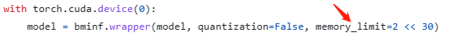
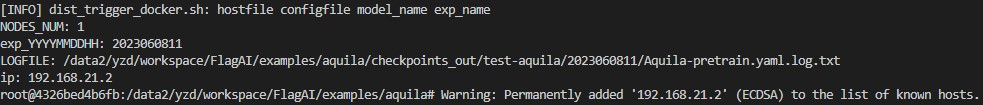

# 悟道·天鹰（Aquila）

悟道·天鹰（Aquila） 语言大模型是首个具备中英双语知识、支持商用许可协议、国内数据合规需求的开源语言大模型。
- 🌟 **支持开源商用许可**。Aquila系列模型的源代码基于 [Apache 2.0 协议](https://www.apache.org/licenses/LICENSE-2.0)，模型权重基于[《智源Aquila系列模型许可协议》](../../../BAAI_Aquila_Model_License.pdf)，使用者在满足许可限制的情况下，可用于商业目的。
- ✍️ **具备中英文知识**。Aquila系列模型在中英文高质量语料基础上从 0 开始训练，中文语料约占 40%，保证模型在预训练阶段就开始积累原生的中文世界知识，而非翻译而来的知识。
- 👮‍♀️**符合国内数据合规需求**。Aquila系列模型的中文语料来自智源多年积累的中文数据集，包括来自1万多个站源的中文互联网数据（其中99%以上为国内站源），以及获得国内权威机构支持的高质量中文文献数据、中文书籍数据等。我们仍在持续积累高质量、多样化的数据集，并源源不断加入Aquila基础模型后续训练中。
- 🎯**持续迭代，持续开源开放**。我们将不断完善训练数据、优化训练方法、提升模型性能，在更优秀的基础模型基座上，培育枝繁叶茂的“模型树”，持续开源开放更新的版本。

**Read this in [English](./README_en.md).**

悟道 · 天鹰 Aquila 模型的更多细节将在官方技术报告中呈现，预计 2023 年 6 月底发布。请关注官方渠道更新。包括 [FlagAI GitHub仓库](https://github.com/FlagAI-Open/FlagAI/)，[FlagAI 知乎账号](https://www.zhihu.com/people/95-22-20-18)、[FlagAI 官方技术交流群](https://github.com/FlagAI-Open/FlagAI/blob/master/wechat-qrcode.jpg)、智源研究院微信公众号、智源社区微信公众号。


|   模型          |  模型类型    | 简介  |  文件路径   |   单独下载模型权重  |  状态   |  训练所用显卡   |                                   
| :---------------- | :------- | :-- |:-- |   :-- | :-- | :-- | 
| Aquila-7B         | 基础模型，70亿参数  |   **Aquila 基础模型**在技术上继承了 GPT-3、LLaMA 等的架构设计优点，替换了一批更高效的底层算子实现、重新设计实现了中英双语的 tokenizer，升级了 BMTrain 并行训练方法，实现了比 Magtron+DeepSpeed ZeRO-2 将近８倍的训练效率。   | [./examples/Aquila/Aquila-pretrain](https://github.com/FlagAI-Open/FlagAI/tree/master/examples/Aquila/Aquila-pretrain)  | [下载Aquila-7B](http://model.baai.ac.cn/model-detail/100098) | 已发布 | Nvidia-A100 |
| Aquila-33B          |基础模型，330亿参数  |    同上    | ——  | ——  | **敬请期待** | Nvidia-A100 | 
| AquilaChat-7B          |SFT 模型，基于 Aquila-7B 进行微调和强化学习  |    **AquilaChat 对话模型**支持流畅的文本对话及多种语言类生成任务，通过定义可扩展的特殊指令规范，实现 AquilaChat对其它模型和工具的调用，且易于扩展。 <br><br>例如，调用智源开源的 **[AltDiffusion](https://github.com/FlagAI-Open/FlagAI/tree/master/examples/AltDiffusion-m18) 多语言文图生成模型**，实现了流畅的文图生成能力。配合智源 **InstructFace 多步可控文生图模型**，轻松实现对人脸图像的多步可控编辑。  |   [./examples/Aquila/Aquila-chat](https://github.com/FlagAI-Open/FlagAI/tree/master/examples/Aquila/Aquila-chat)  | [下载AquilaChat-7B](https://model.baai.ac.cn/model-detail/100101) | 已发布  | Nvidia-A100  | 
| AquilaChat-33B           |SFT 模型，基于 Aquila-33B 进行微调和强化学习 |   同上    |   ——    |——  | **敬请期待** | Nvidia-A100 | 
| AquilaCode-multi         | 基础模型，“文本-代码”生成模型，基于 Aquila-7B继续预训练  |   AquilaCode 使用经过高质量过滤且有合规开源许可的代码数据进行训练，数据量约为其他开源代码生成模型的 10～40%。通过参考官方提供的操作指南，开发者可以利用 AquilaCode 模型来定制自己的代码助手。  | [./examples/Aquila/Aquila-code](https://github.com/FlagAI-Open/FlagAI/tree/master/examples/Aquila/Aquila-code)  |[下载AquilaCode-7B-multi](https://model.baai.ac.cn/model-detail/100104)  | 已发布  | Nvidia-A100 | 
| AquilaCode-py           |基础模型，“文本-代码”生成模型，基于 Aquila-7B继续预训练。  |    AquilaCode 使用经过高质量过滤且有合规开源许可的代码数据进行训练，数据量约为其他开源代码生成模型的 10～40%。通过参考官方提供的操作指南，开发者可以利用 AquilaCode 模型定制自己的代码助手。    | [./examples/Aquila/Aquila-code](https://github.com/FlagAI-Open/FlagAI/tree/master/examples/Aquila/Aquila-code)  | [下载AquilaCode-py](https://model.baai.ac.cn/model-detail/100103)  | 已发布  | Nvidia-A100  | 

悟道·天鹰Aquila系列模型将持续开源更优版本，大家可以先删除原来目录下的`checkpoints_in/aquila-7b`，再下载新权重，其他使用方式不变。

- 2023/07/24 ：发布权重文件 v0.9，开源了 AquilaCode-multi、AquilaCode-py。 AquilaChat-7B和Aquila-7B权重无更新, AquilaCode-7B-NV和AquilaCode-7B-TS权重暂时不会有更新计划。
  - Aquila-7B md5: 18eac56434db0198494b22b321633785
  - AquilaChat-7B md5: 465683009c8b536ef4cca85febb0227c
  - AquilaCode-multi md5：07cfce9440a0fa1ac2768b39d2cf4286
  - AquilaCode-py md5：3faa85fc03d8fda70a73064f48d02d85

Aquila-7B 新版本模型 在 FlagEval 大模型评测中（ “客观”）相比0.7的版本在MMLU_Chinese、TruthfulQA、MMLU上分别提升10.07%，14.84%和7.94%。详细评测结果请通过 http://flageval.baai.ac.cn 网站查看。历史版本变更详情见：[变更日志](https://github.com/FlagAI-Open/FlagAI/blob/master/examples/Aquila/changelog_zh.md) 。


<br>如有使用问题请先查看 [FAQ](https://github.com/FlagAI-Open/FlagAI/issues/371)，若不能解决，请直接提交 [issue](https://github.com/FlagAI-Open/FlagAI/issues) ~

## 快速开始使用 Aquila-7B 基础模型

### 基础模型的环境准备

1. 在本地克隆FlagAI github仓库
   
    ```
    git clone https://github.com/FlagAI-Open/FlagAI.git
    ```

2. 进入仓库，从源码安装FlagAI
   
    ```
    cd FlagAI
    python setup.py install
    ```
    注：我们目前支持在Ubuntu, Mac和Mac上运行，详细环境依赖信息可参考 [FlagAI环境安装](../../../README_zh.md#quick-start)

3. 进入**Aquila-7B基础模型**目录
    ```
    cd examples/Aquila/Aquila-pretrain
    ```
对于Aquila-7B模型，我们提供**模型推理**，**预训练**，**微调**三种使用方式：

### 基础模型推理

正常模型推理(显存资源消耗约为14.6GB)：
```
python generate.py
```
使用[BMInf](https://github.com/OpenBMB/BMInf)进行低资源推理(可调整所用内存)
```
python generate_bminf.py
```
默认参数下显存资源消耗为4.3GB，可通过memory_limit参数手动设置最大资源消耗，如下图所示(2 << 30 代表2GB)：


推理程序运行完毕之后，Aquila-7B模型会自动下载到`./checkpoints_in`里

<details><summary>示例输出如下：</summary>

模型对于示例prompt"汽车EDR是什么"给出随机回复


</details>
注意：Aquila-7B基础模型用来做对话推理效果不如可监督微调后的AquilaChat-7B对话模型。

### 基础模型微调-SFT

1. 进入对话模型微调目录Aquila-chat, 并在checkpoints_in目录下准备好需要微调的预训练模型
  
    假设刚刚在Aquila-pretrain下运行了推理脚本，则可以运行
    ```
    cd ../Aquila-chat
    mv ../Aquila-pretrain/checkpoints_in ./
    ```

2. 配置`hostfile`文件
    <details><summary>详情如下：</summary>

    以单机八卡为例

    1. 查看本机ip地址

        ```
        ifconfig eth0 | grep "inet " | awk '{print $2}'
        ```

    2. 在`hostfile`里填入

            ```
            [上一步得到的ip地址] slots=8
            ```
        注：slots=8代表使用八张GPU, 如果单卡的情况下slots=1
    3. 确认本机可以免密登录,可用如下指令测试

            ```
            ssh localhost
            ```
        如果不能免密登录，可以尝试以下方法配置免密或者使用local_trigger_docker.sh来运行(如下一步所示)

            ```
            ssh-keygen -t rsa  
            cat ~/.ssh/id_rsa.pub >> ~/.ssh/authorized_keys 
            service sshd restart
            ```
    
    </details>

4. 启动训练脚本
    ```
    bash dist_trigger_docker.sh hostfile Aquila-chat.yaml aquila-7b aquila_experiment
    ```
    其中各个参数含义如下：
    ```
    dist_trigger_docker.sh # 多机多卡运行的脚本文件，单机可选用local_trigger_docker.sh
    hostfile                 host配置文件
    Aquila-chat.yaml         模型参数配置文件
    aquila-7b                模型名称，注意需要小写
    aquila_experiment        实验名称，可自定义
    ```

    **如果启动LoRA微调(在单张V100上运行微调为例)，上一步改为运行**
    ```
    bash local_trigger_docker.sh hostfile Aquila-chat-lora.yaml aquila-7b aquila_experiment
    ```
    注：lora会训练出来一个adapter_config.json和adapter_model.bin文件，位置在输出目录下(与log文件同级)；推理请运行`Aquila-chat/generate_chat_lora.py`文件，与普通推理的区别是autoloader加载模型推理时需要将adapter文件的目录放到adapter_dir参数里

<details><summary>正确运行输出信息如下所示：</summary>

首先会输出下列信息，注意`NODES_NUM`应该与节点数相等，`LOGFILE`是模型运行的日志文件。



成功训练之前能在日志里看到如下信息(具体参数可能不同)。


</details>

### 基础模型预训练

目前7B基础模型预训练最低可在单张Nvidia-A100-80G上运行(需要调整batch_size)

1. 进入预训练目录Aquila-pretrain，[配置hostfile文件](#基础模型微调-sft)
   
2. 启动训练脚本

    ```
    bash dist_trigger_docker.sh hostfile Aquila-pretrain.yaml aquila-7b aquila_experiment
    ```

### 调整参数

对于以上示例，您可以通过修改下列参数来达到不同的训练和推理效果：

🌟执行预训练和微调任务前，可在训练脚本中的yaml文件里修改参数

|   参数名          |  类型   | 描述  |                                  
| :---------------- | :------- | :-- |   
| batch_size         | int  |   每次迭代训练时，从数据集中抽取的样本数。一般来说，它越大，处理速度越快，但会占用更多的内存;   |
| gradient_accumulation_steps          |int  |    在更新模型权重之前，要对多个小批次进行梯度计算的次数。主要应用于GPU显存较小的情况下，可以使用小的batch_size，通过梯度累积达到与大batch_size相同的效果;     |
| lr          |float  |    指控制模型更新参数时的步长或速率。学习率过高可能导致模型不收敛，而学习率过低则可能导致训练时间过长或者陷入局部最优解;    |   
| warm_up           |float |   初始学习率与原始学习率的比例;     | 
| save_interval         | int  |   模型保存的间隔，即每训练多少个iteration保存一次模型。当训练时间较长时，保存间隔可以避免因突然中断或出现错误导致训练成果全部丢失;   | 
| log_interval           |int  |    日志输出的间隔，即每训练多少个iteration输出一次日志信息    | 
| lora           |int  |    日志输出的间隔，即每训练多少个iteration输出一次日志信息    | 
| enable_sft_dataset_dir           |str  |    SFT训练数据集的目录    | 
| enable_sft_dataset_file           |str  |    SFT训练数据集的文件名    | 

完整参数信息可参考https://github.com/FlagAI-Open/FlagAI/blob/master/flagai/env_args.py

🌟对于推理任务，可在推理文件里执行`aquila_generate`函数时重设下列参数:

|   参数名          |  类型   | 默认值  | 描述  |                                  
| :---------------- | :------- | :-- |  :-- |   
| temperature       | float  | 0.8  |   温度控制着模型生成新词时的随机性程度。在基于概率的语言模型中，每个词都有一个与之对应的概率分布，温度通过增加或减少这些概率分布来影响模型生成单词的随机性。较高的温度会使得模型更倾向于选择概率较小的单词，从而生成更多的“冒险”文本。相反，较低的温度会强制模型更加倾向于选择概率最大的单词，从而生成更加可预测的文本。常见的温度值范围为0.5-1.5。   |
| topk         |int  | 30  |    Top-k控制着模型生成新词时的选择数量。在生成每个新词时，模型会预测出若干个可能的单词，Top-k参数会限制模型只选择概率最大的前k个单词中的一个来作为生成的单词。Top-k可以帮助稳定生成过程，防止模型随意选择概率很小的单词。     |
| topp        |float  |0.95  |     跟Top-k类似，Top-p也是控制着模型生成新词时的选择数量。在生成每个新词时，模型会预测出若干个可能的单词，Top-p参数会限制模型只选择概率最高的一些候选单词，直到这些候选单词的总概率达到一个阈值（如0.9或0.8）。Top-p可以帮助避免产生不符合语境的单词。    |   
| max_length           |int | 200  |   为了避免生成无限长的文本，我们需要限制生成的文本长度。Max_length参数控制生成文本的最大长度，一旦达到该长度，模型就会停止生成。Aquila系列模型的最大长度为2048个token。   | 


## 证书

Aquila-7B和Aquila-33B开源模型使用 [智源Aquila系列模型许可协议](../../../BAAI_Aquila_Model_License.pdf), 原始代码基于[Apache Licence 2.0](https://www.apache.org/licenses/LICENSE-2.0)。

