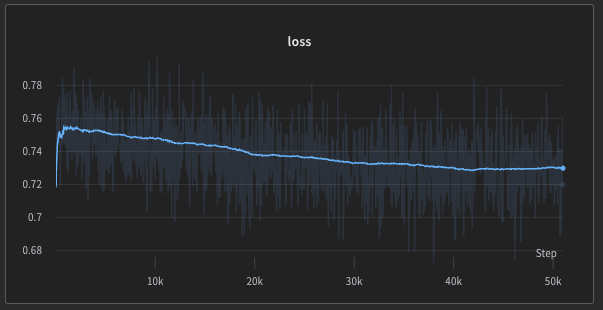
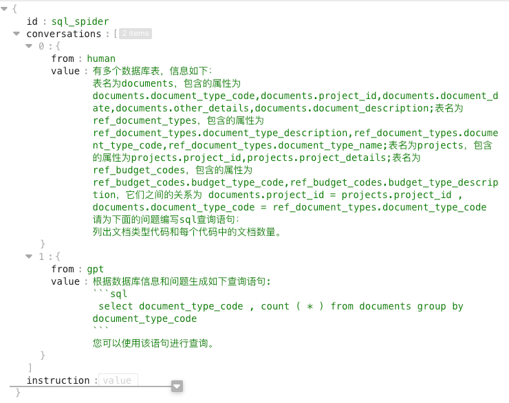
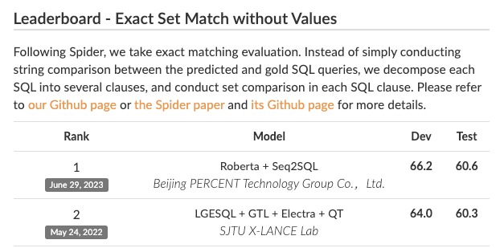
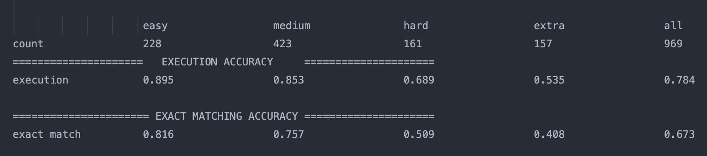
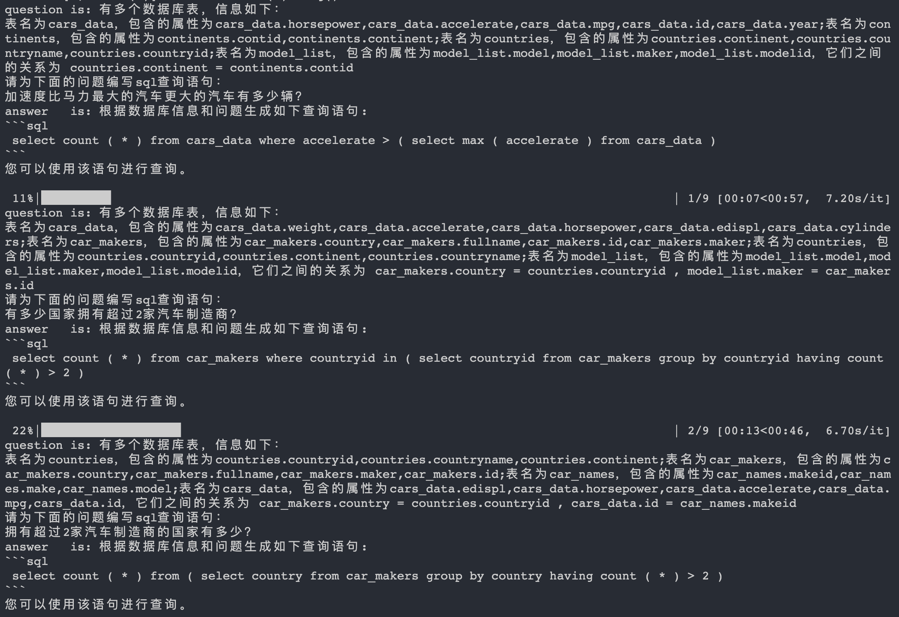
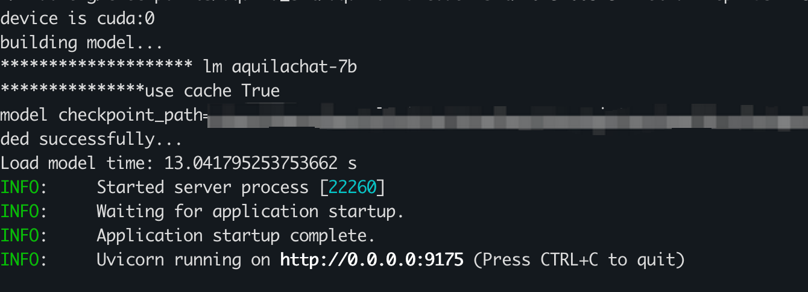

# 悟道·天鹰（Aquila）

悟道·天鹰（Aquila） 语言大模型是首个具备中英双语知识、支持商用许可协议、国内数据合规需求的开源语言大模型。
- 🌟 **支持开源商用许可**。Aquila系列模型的源代码基于 [Apache 2.0 协议](https://www.apache.org/licenses/LICENSE-2.0)，模型权重基于[《智源Aquila系列模型许可协议》](../../BAAI_Aquila_Model_License.pdf)，使用者在满足许可限制的情况下，可用于商业目的。
- ✍️ **具备中英文知识**。Aquila系列模型在中英文高质量语料基础上从 0 开始训练，中文语料约占 40%，保证模型在预训练阶段就开始积累原生的中文世界知识，而非翻译而来的知识。
- 👮‍♀️**符合国内数据合规需求**。Aquila系列模型的中文语料来自智源多年积累的中文数据集，包括来自1万多个站源的中文互联网数据（其中99%以上为国内站源），以及获得国内权威机构支持的高质量中文文献数据、中文书籍数据等。我们仍在持续积累高质量、多样化的数据集，并源源不断加入Aquila基础模型后续训练中。
- 🎯**持续迭代**，持续开源开放。我们将不断完善训练数据、优化训练方法、提升模型性能，在更优秀的基础模型基座上，培育枝繁叶茂的“模型树”，持续开源开放更新的版本。


悟道 · 天鹰 Aquila 模型的更多细节将在官方技术报告中呈现。请关注官方渠道更新。包括 [FlagAI GitHub仓库](https://github.com/FlagAI-Open/FlagAI/)，[FlagAI 知乎账号](https://www.zhihu.com/people/95-22-20-18)、[FlagAI 官方技术交流群](https://github.com/FlagAI-Open/FlagAI/blob/master/wechat-qrcode.jpg)、智源研究院微信公众号、智源社区微信公众号。


|   模型          |  模型类型    | 简介  |  文件路径   |   单独下载模型权重  |  状态   |  训练所用显卡   |
| :---------------- | :------- | :-- |:-- |   :-- | :-- | :-- |
| Aquila-7B         | 基础模型，70亿参数  |   **Aquila 基础模型**在技术上继承了 GPT-3、LLaMA 等的架构设计优点，替换了一批更高效的底层算子实现、重新设计实现了中英双语的 tokenizer，升级了 BMTrain 并行训练方法，实现了比 Magtron+DeepSpeed ZeRO-2 将近８倍的训练效率。   | [./examples/Aquila/Aquila-pretrain](https://github.com/FlagAI-Open/FlagAI/tree/master/examples/Aquila/Aquila-pretrain)  | [下载Aquila-7B](http://model.baai.ac.cn/model-detail/100098)<br> [HF仓库地址](https://huggingface.co/BAAI/Aquila-7B) | 已发布 | Nvidia-A100 |
| Aquila-33B          |基础模型，330亿参数  |    同上    | ——  | ——  | **敬请期待** | Nvidia-A100 |
| AquilaChat-7B          |SFT 模型，基于 Aquila-7B 进行微调和强化学习  |    **AquilaChat 对话模型**支持流畅的文本对话及多种语言类生成任务，通过定义可扩展的特殊指令规范，实现 AquilaChat对其它模型和工具的调用，且易于扩展。 <br><br>例如，调用智源开源的 **[AltDiffusion](https://github.com/FlagAI-Open/FlagAI/tree/master/examples/AltDiffusion-m18) 多语言文图生成模型**，实现了流畅的文图生成能力。配合智源 **InstructFace 多步可控文生图模型**，轻松实现对人脸图像的多步可控编辑。  |   [./examples/Aquila/Aquila-chat](https://github.com/FlagAI-Open/FlagAI/tree/master/examples/Aquila/Aquila-chat)  | [下载AquilaChat-7B](https://model.baai.ac.cn/model-detail/100101) <br> [HF仓库地址](https://huggingface.co/BAAI/AquilaChat-7B)| 已发布  | Nvidia-A100  |
| AquilaChat-33B           |SFT 模型，基于 Aquila-33B 进行微调和强化学习 |   同上    |   ——    |——  | **敬请期待** | Nvidia-A100 |
| AquilaCode-multi         | 基础模型，“文本-代码”生成模型，基于 Aquila-7B继续预训练  |   AquilaCode 使用经过高质量过滤且有合规开源许可的代码数据进行训练，数据量约为其他开源代码生成模型的 10～40%。通过参考官方提供的操作指南，开发者可以利用 AquilaCode 模型来定制自己的代码助手。  | [./examples/Aquila/Aquila-code](https://github.com/FlagAI-Open/FlagAI/tree/master/examples/Aquila/Aquila-code)  |[下载AquilaCode-7B-multi](https://model.baai.ac.cn/model-detail/100104) <br> [HF仓库地址](https://huggingface.co/BAAI/AquilaCode-multi) | 已发布  | Nvidia-A100 |
| AquilaCode-py           |基础模型，“文本-代码”生成模型，基于 Aquila-7B继续预训练。  |    AquilaCode 使用经过高质量过滤且有合规开源许可的代码数据进行训练，数据量约为其他开源代码生成模型的 10～40%。通过参考官方提供的操作指南，开发者可以利用 AquilaCode 模型定制自己的代码助手。    | [./examples/Aquila/Aquila-code](https://github.com/FlagAI-Open/FlagAI/tree/master/examples/Aquila/Aquila-code)  | [下载AquilaCode-py](https://model.baai.ac.cn/model-detail/100103) <br> [HF仓库地址](https://huggingface.co/BAAI/AquilaCode-py) | 已发布  | Nvidia-A100  |
| AquilaSQL-7B           |对话模型，“文本-代码”生成模型，基于 AquilaCode继续预训练+SFT。  |   AquilaSQL在代码基础模型AquilaCode上进行继续预训练和sft微调，为模型设计了指标评估体系，目前在cspider榜单上达到了sota，可以通过更改数据的方式适配不同领域的sql查询场景。    | [./examples/Aquila/Aquila-sql](https://github.com/FlagAI-Open/FlagAI/tree/master/examples/Aquila/Aquila-sql)  | [下载AquilaSQL-7B](https://model.baai.ac.cn/model-detail/100115) <br> [HF仓库地址](https://huggingface.co/BAAI/AquilaSQL-7B) | 已发布  | Nvidia-A100  |

悟道·天鹰Aquila系列模型将持续开源更优版本，大家可以先删除原来目录下的code模型路径，再下载新权重，其他使用方式不变。


## 训练评估流程

1. 预训练流程与code模型预训练完全一致，这里不在赘述
 - 收集数据：网络爬取sql数据，huggingface数据集收集，开源数据如下所示，可以自行收集
    ```python
    opensource_data_map = {
    "autotrain-data-nl-to-sql": ["https://huggingface.co/datasets/Aditya011/autotrain-data-nl-to-sql", "./sql-data-raw/autotrain-data-nl-to-sql-train.csv"],
    "pg-wikiSQL-sql-instructions-80k": ["https://huggingface.co/datasets/kaxap/pg-wikiSQL-sql-instructions-80k/tree/main", "./sql-data-raw/pg-wikiSQL-sql-instructions-80k-train.csv"],
    "pg-wikiSQL-sql-instructions-80k-val": ["https://huggingface.co/datasets/kaxap/pg-wikiSQL-sql-instructions-80k/tree/main", "./sql-data-raw/pg-wikiSQL-sql-instructions-80k-dev.csv"],
    "pg-gpt4SQL-sql-instructions-1k": ["https://huggingface.co/datasets/kaxap/pg-gpt4SQL-sql-instructions-1k", "./sql-data-raw/pg-gpt4SQL-sql-instructions-1k.csv"],
    "Text-to-sql-v1": ["https://huggingface.co/datasets/Clinton/Text-to-sql-v1", "./sql-data-raw/Text-to-sql-v1.jsonl"],
    "sql-create-context": ["https://huggingface.co/datasets/b-mc2/sql-create-context/tree/main", "./sql-data-raw/sql_create_context_v4.json"],
    "Llama-2-SQL-Dataset": ["https://huggingface.co/datasets/ChrisHayduk/Llama-2-SQL-Dataset", "./sql-data-raw/Llama-2-SQL-Dataset-train-00000-of-00001-1ba781ea67c6bd7f.parquet"],
    "sql-context-instructions": ["https://huggingface.co/datasets/goendalf666/sql-context-instructions/tree/main", "./sql-data-raw/sql-context-instructions-train-00000-of-00001-a2d2f513b79f5b3d.parquet"],
    "symbolic-instruction-tuning-sql": ["https://huggingface.co/datasets/tasksource/symbolic-instruction-tuning-sql", "./sql-data-raw/symbolic-instruction-tuning-sql-train-00000-of-00001-09775d42d91b2c08.parquet"]
    }
    ```
    - 数据处理：将数据处理成Aquila模型预训练格式，并制作成二进制文件
    - 数据规模：2M
    - 硬件配置：4机，8卡，A100-40G
    - 训练配置：[Aquila-pretrain-4n8g.yaml](./Aquila-pretrain-4n8g.yaml)
    - 训练阶段曲线
    

2. SFT训练

    为了进行指标计算，将sft数据中answer部分按照固定格式进行制作，便于后续解析，示例如下
    
    - 数据来源：wikisql，spider,cspider开源数据集训练集进行配比完成
    - 数据位置为：[sft-data](./data/sql_generate_from_spider_wikisql_train_weighted.jsonl)
    - 训练配置为：[Aquila-sft-sql.yaml](./Aquila-sft-sql.yaml)

3. sql指标计算
    用于评估代码模型的humaneval不支持sql语言，这里使用text2sql领域常用的评估方式，评估生产的sql语句与标签的匹配度和编译通过率两个指标
    - 模型结构转换：将训练好的模型转换成flagai模型结构，[s1_convert_flash2flagai.py](./metric/s1_convert_flash2flagai.py)，可在[这里]()下载
    - 模型推理：[s2_model_infer_gen_sql.py](./metric/s2_model_infer_gen_sql.py) 使用语言模型生成查询语句的sql语句，并将输出结果保存到[evaluation_result](./evaluation_result)中；
    - 指标计算：[s3_calculate_sql_acc.py](./metric/s3_calculate_sql_acc.py) 计算生成的sql语句的指标
    - 排行榜：https://taolusi.github.io/CSpider-explorer/
    
    - aquila-sql指标表现
    

## 快速开始使用 AquilaCode-7B 基础模型

### 基础模型的环境准备

1. 在本地克隆FlagAI github仓库

    ```
    git clone https://github.com/FlagAI-Open/FlagAI.git
    ```

2. 进入仓库，从源码安装FlagAI

    ```
    cd FlagAI
    python setup.py install
    ```
    注：我们目前支持在Ubuntu, Mac和Mac上运行，详细环境依赖信息可参考 [FlagAI环境安装](../../../README_zh.md#quick-start)

3. 进入**AquilaCode-7B基础模型**目录
    ```
    cd examples/Aquila/Aquila-sql
    ```

### 模型推理
- 模型下载
    - 直接modelhub下载

    - autoloader的形式下载
    ```
    start_time = time.time()
    loader = AutoLoader(
        "lm",
        model_dir=state_dict,
        model_name=model_name,
        use_cache=True,
        fp16=True,
        device=device)
    ```

- 本地推理测试

```
CUDA_VISIBLE_DEVICES=0 python3 server_local.py  ckpt_dir
```
运行之后模型有如下生成



- 创建server用于request访问

```
CUDA_VISIBLE_DEVICES=1 python3 server_web.py ckpt_dir
```

运行之后，终端有如下输出，表示服务启动成功，可以使用request的方式调用



- 使用huggingface的模型进行推理
hf模型位置

```
CUDA_VISIBLE_DEVICES=1 python3 server_hf.py ckpt_dir
```

## 证书

AquilaSQL-7B [智源Aquila系列模型许可协议](../../../BAAI_Aquila_Model_License.pdf), 原始代码基于[Apache Licence 2.0](https://www.apache.org/licenses/LICENSE-2.0)。

