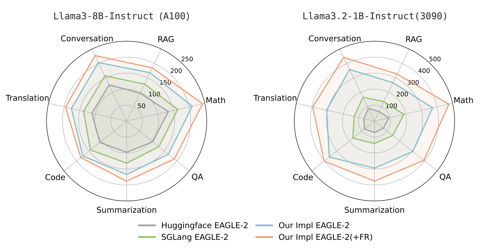

# FR-Spec: Frequency-Ranked Speculative Sampling

[](https://arxiv.org/abs/2502.14856) [](https://opensource.org/licenses/MIT)

## Introduction

> This is the C/CUDA implementation for FR-Spec

Surprisingly, EAGLE-2's bottleneck is LM-Head.

Leveraging the 'long-tail' property of token distribution, we achieve a **1.12x speedup** over EAGLE-2.

Our method is simple to implement, preserves generation quality, and requires no retraining.

👉 **[Read our paper](https://arxiv.org/abs/2502.14856)**

## Decoding Speed

<div align="center">
  
</div>
Decoding speed (token/s) of FR-Spec and EAGLE-2 for Llama3-8B and Llama3.2-1B under different frameworks.

## News

**2025.05.29** Our subsequent work: a systematic analysis of Speculative + Quantization: ([paper](https://arxiv.org/pdf/2505.22179)).

**2025.05.15** Accepted. (ACL 2025 main)

**2025.03.03** Feature merged to SGLang ([link](https://docs.sglang.ai/backend/speculative_decoding.html#EAGLE-Decoding-via-Frequency-Ranked-Speculative-Sampling)).

**2025.03.01** Implementation framework released.

**2025.02.26** Token-frequency statistics released.

## Installation from source

```bash
conda create -n fr-spec python==3.11 && conda activate fr-spec
# install pytorch for your platform, see https://pytorch.org
git clone https://github.com/thunlp/FR-Spec.git --recursive && cd FR-Spec
vim setup.py # change arch="80" to other code for your platform, see https://developer.nvidia.com/cuda-gpus#compute
pip install .
```

## Evaluation

### Model Weights

Download the corresponding model weights and save them in the `models` folder.

### Prepare Fr-Spec vocabulary subset

You can download our processed token-frequency statistics:

- [LLaMA3-Instruct-8B-FR-Spec](https://huggingface.co/thunlp/LLaMA3-Instruct-8B-FR-Spec)
- [LLaMA3.2-Instruct-1B-FR-Spec](https://huggingface.co/thunlp/LLaMA3.2-Instruct-1B-FR-Spec)

Or you can also get your token-frequency statistics based on our script:

```bash
cd fr
python fr.py --model_name <model_name> --model_path <model_path> --num_lines <num_lines> --vocab_size <vocab_size>
```
- `model_name`: The name of the model (e.g.`llama3-8b-instruct`).
- `model_path`: The path to the model (e.g. `meta-llama/Meta-Llama-3-8B-Instruct`).
- `num_lines`: Number of lines to process from the SlimPajama dataset. Defaults to `1000000`.
- `vocab_size`: A list of vocabulary sizes to process. Each size represents a subset of the most frequent tokens to keep. Default values are `[8192, 16384, 32768, 65536]`.

An example command for generating token frequency statistics from 1 million lines of the SlimPajama dataset for the Llama-3-8B-Instruct model:
```bash
python fr.py --model_name llama3-8b-instruct --model_path meta-llama/Meta-Llama-3-8B-Instruct --num_lines 1000000 --vocab_size <vocab_size>
```

The script analyzes token frequency distribution across `num_lines` of the SlimPajama corpus and saves the most frequent tokens (as specified by `vocab_size`) to the corresponding directory in `fr-index`. Copy the generated token-frequency files to the corresponding FR-Spec model folder to enable their use in your experiments.

**🌟Welcome:** We encourage you to upload your processed vocabulary for different models to HuggingFace (model name suffixed with ​FR-Spec).

### Run Evaluation

All scripts for evaluation are located in the `scripts` folder. Here we use Llama-3-8B-Instruct as an example:

```bash
# 1. Run evaluations
bash scripts/<benchmark>/llama3-8b-instruct/run_baseline.sh
bash scripts/<benchmark>/llama3-8b-instruct/run_eagle.sh
bash scripts/<benchmark>/llama3-8b-instruct/run_eagle_fr_spec.sh

# 2. Evaluate speed
bash scripts/<benchmark>/llama3-8b-instruct/speed_up.sh

# 3. Check correctness (for human_eval and gsm8k only)
bash scripts/<benchmark>/llama3-8b-instruct/check_correctness.sh
```

Replace `<benchmark>` with one of: `spec_bench`, `human_eval`, or `gsm8k`.

## Contributors

- [Weilin Zhao](https://github.com/Achazwl)

- [Yudi Zhang](https://github.com/YudiZh)

- [Tengyu Pan](https://github.com/ThonyPan)

## Acknowledgment

Our experiments are based on https://github.com/SafeAILab/EAGLE and https://github.com/FasterDecoding/Medusa.

The `evaluation/` folder is modified base on https://github.com/hemingkx/Spec-Bench.

The `src/flash_attn/` folder is modified base on https://github.com/Dao-AILab/flash-attention/blob/v2.4.2/csrc/flash_attn.

## Citation

```
@article{zhao2025fr,
  title={FR-Spec: Accelerating Large-Vocabulary Language Models via Frequency-Ranked Speculative Sampling},
  author={Zhao, Weilin and Pan, Tengyu and Han, Xu and Zhang, Yudi and Sun, Ao and Huang, Yuxiang and Zhang, Kaihuo and Zhao, Weilun and Li, Yuxuan and Wang, Jianyong and others},
  journal={arXiv preprint arXiv:2502.14856},
  year={2025}
}
```
