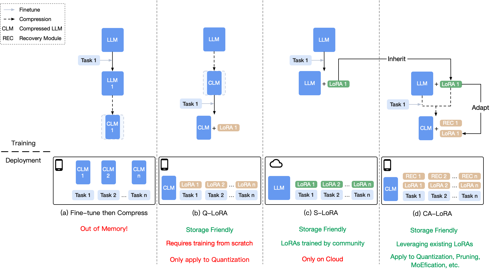

<div align="center">

<h1>CA-LoRA</h1>

**Adapting Existing LoRA for Compressed LLMs to Enable Efficient Multi-Tasking on Personal Devices**
</div>



## Introduction

This repository has the source code for the paper CA-LoRA, accepted at COLM 2024.

Considering that the open-source community has already contributed many LoRAs to LLMs, we propose to adapt these existing LoRAs from the LLMs to their compressed version and introduce a Compression-Aware LoRA (CA-LoRA) framework. We incorporate knowledge inheritance and recovery strategies to recover the lost knowledge caused by model compression. Experiment results demonstrate that CA-LoRA outperforms the vanilla LoRA methods applied to a compressed LLM and achieves comparable performance to the non-compressed LLM with existing LoRA modules. 

## Repo Content

This repo contains the code to reproduce the experimental results in our paper. 
- Section 4.1: Task-specific fine-tuning
  - [README](src/section-4.1/README.md) [Code](src/section-4.1) T5 experiments implemented based on [BMCook](https://github.com/OpenBMB/BMCook) and [OpenDelta](https://github.com/thunlp/OpenDelta).
- Section 4.2: Instruction tuning
  - 4.2.1: [README](src/section-4.2.1/README.md) [Code](src/section-4.2.1) Llama experiments implemented on [OpenDelta](https://github.com/thunlp/OpenDelta).
  - 4.2.2: [README](src/section-4.2.2/README.md) [Code](src/section-4.2.2) Llama-2 experiments implemented on [PEFT](https://github.com/huggingface/peft)

## Citation

Please cite our [paper](https://arxiv.org/pdf/2307.07705) if you find our work valuable.

```
@article{zhao2024calora,
      title={CA-LoRA: Adapting Existing LoRA for Compressed LLMs to Enable Efficient Multi-Tasking on Personal Devices}, 
      author={Weilin Zhao and Yuxiang Huang and Xu Han and Zhiyuan Liu and Zhengyan Zhang and Kuai Li and Chen Chen and Tao Yang and Maosong Sun},
      journal={arXiv preprint arXiv:2307.07705},
      year={2024}, 
}
```
