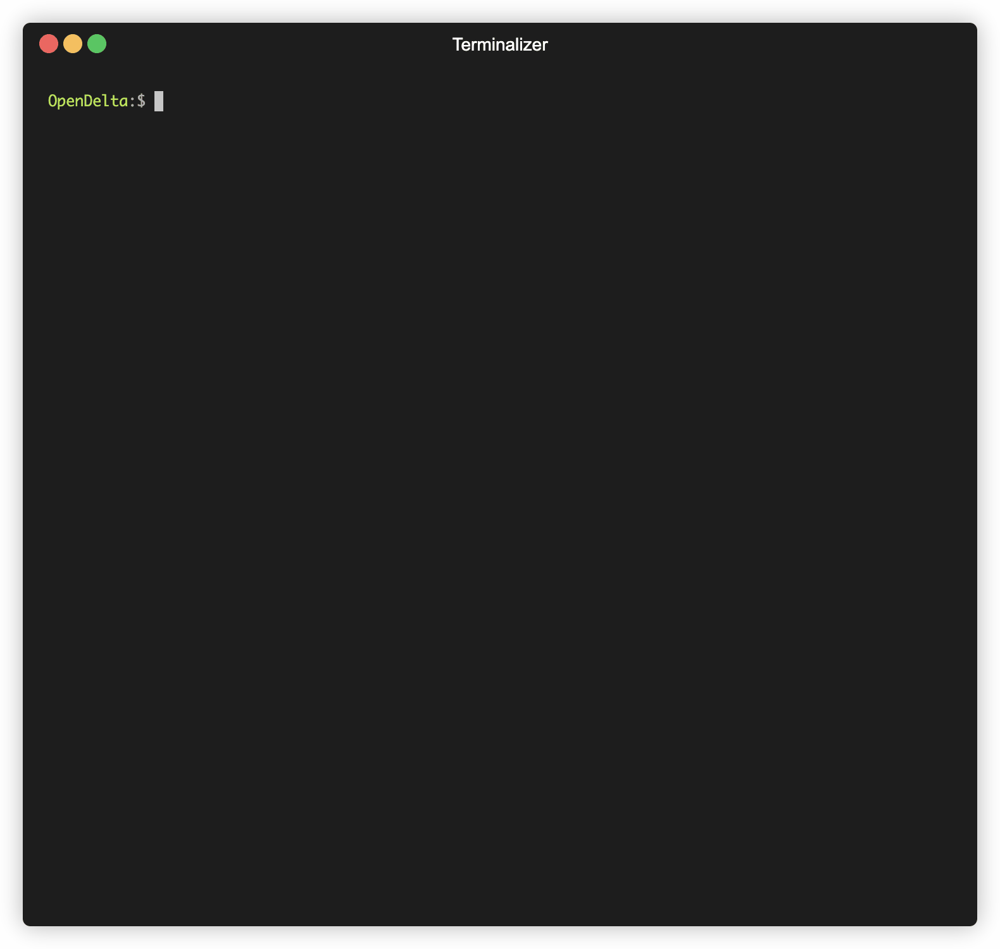

<div align="center">


**An Open-Source Framework for Parameter-Efficient Tuning (Delta Tuning).**

------

<p align="center">
  <a href="#Overview">Overview</a> •
  <a href="#installation">Installation</a> •
  <a href="https://opendelta.readthedocs.io/en/latest/notes/usage.html">Basic Usage</a> • 
  <a href="https://opendelta.readthedocs.io/">Docs</a> • 
  <a href="https://docs.google.com/spreadsheets/d/1BIVa8ocAPga-u7rBOXLYaTfaJSjI1dWfwohmLjmFDrY/edit?usp=sharing">Performance</a> •


</p>

</div>


## Overview

OpenDelta is a toolkit for parameter-efficient tuning methods (we dub it as *delta tuning*), by which users could flexibly assign (or add) a small amount parameters to update while keeping the most parameters frozen. By using OpenDelta, users could easily implement prefix-tuning, adapters, Lora, or any other types of delta tuning with preferred PTMs.

- The latest version of OpenDelta is tested on Python==3.8.13, PyTorch==1.12.1, transformers==4.22.2. Other versions are likely to be supported as well. If you encounter bugs when using your own package versions, please raise an issue, we will look into it as soon as possible. 

- **A demo of using OpenDelta to modify the PLM (E.g., BART).**


## News
- **2022.10.25** Release v0.3.2. Support [BMTrain]()! Improve docs. Add inspect utilities.
- **2022.10.14** Release v0.3.0. We make the usage of default configurations of each delta tuning methods (i.e., the position they are attached) more friendly! If a custom model has our supported models as submodules inside, the default configuration is also available. Other key changes can be seen in [Update Log](https://opendelta.readthedocs.io/en/latest/notes/update.html#version-0-3-0)
- **2022.10.10** Merge a long-developed branch v0.2.4 into the master branch. Key updates are (1) the an example unifying the delta tuning paradigm and the prompt-tuning paradigm; (2) and support for [Delta Center](https://www.openbmb.org/toolKits/deltacenter), whose webpage is still under construction. Details can be seen in [Update Log](https://opendelta.readthedocs.io/en/latest/notes/update.html#version-0-2-4)
- **2022.03.24** We notice several bugs in Soft Prompt Tuning and Prefix Tuning, mainly due to their need to customize attention ids, token_type_ids, we are fixing it! Currently, please use the other methods since they are stabler and better in performance. 
- **2022.03.20** Add a [Colab example](https://colab.research.google.com/drive/1uAhgAdc8Qr42UKYDlgUv0f7W1-gAFwGo?usp=sharing) to illustrate efficient training and space-saving multitask-serving.
- **2022.03.20** A new pip version released.
- **2022.02.16** Support [regular expression](https://opendelta.readthedocs.io/en/latest/notes/namebasedaddr.html#regexexpr) in named-based addressing. 

## Installation
1. create a virtualenv (optional)
```shell
conda create -n opendelta_env python=3.8
conda activate opendelta_env
```

2. install the latest version
```bash
pip install git+https://github.com/thunlp/OpenDelta.git
```

**or** install the latest pip version (more stable)
```bash
pip install opendelta
```
**or** build from source
```bash
git clone git@github.com:thunlp/OpenDelta.git
cd OpenDelta
python setup.py install
# python setup.py develop # if you want to do some modifications on the code for your research:

```

## Must Try
The following codes and comments walk you through the key functionality of OpenDelta. It is also in [must_try.py](https://github.com/thunlp/OpenDelta/tree/main/examples/unittest/must_try.py) and [must_try.ipynb in Colab](https://colab.research.google.com/drive/1Nbe9zxt8LGQnKmtvEs07IN_PznjNCyk4?usp=sharing).

```python
# use transformers as usual.
from transformers import AutoModelForSeq2SeqLM, AutoTokenizer
t5 = AutoModelForSeq2SeqLM.from_pretrained("t5-large")
t5_tokenizer = AutoTokenizer.from_pretrained("t5-large")
# A running example
inputs_ids = t5_tokenizer.encode("Is Harry Potter written by J.K. Rowling", return_tensors="pt")
t5_tokenizer.decode(t5.generate(inputs_ids)[0]) 
# >>> '<pad><extra_id_0>? Is it Harry Potter?</s>'


# use existing delta models
from opendelta import AutoDeltaModel, AutoDeltaConfig
# use existing delta models from DeltaCenter
delta = AutoDeltaModel.from_finetuned("thunlp/Spelling_Correction_T5_LRAdapter_demo", backbone_model=t5)
# freeze the whole backbone model except the delta models.
delta.freeze_module()
# visualize the change
delta.log()


t5_tokenizer.decode(t5.generate(inputs_ids)[0]) 
# >>> <pad> Is Harry Potter written by J.K. Rowling?</s>


# Now save merely the delta models, not the whole backbone model, to tmp/
delta.save_finetuned(".tmp")
import os; os.listdir(".tmp")
# >>>  The state dict size is 1.443 MB
# >>>  We encourage users to push their final and public models to delta center to share them with the community!


# reload the model from local url and add it to pre-trained T5.
t5 = AutoModelForSeq2SeqLM.from_pretrained("t5-large")
delta1 = AutoDeltaModel.from_finetuned(".tmp", backbone_model=t5)
import shutil; shutil.rmtree(".tmp") # don't forget to remove the tmp files. 
t5_tokenizer.decode(t5.generate(inputs_ids)[0]) 
# >>> <pad> Is Harry Potter written by J.K. Rowling?</s>

# detach the delta models, the model returns to the unmodified status.
delta1.detach()
t5_tokenizer.decode(t5.generate(inputs_ids)[0])  
# >>> '<pad><extra_id_0>? Is it Harry Potter?</s>'

# use default configuration for customized wrapped models which have PLMs inside. This is a common need for users. 
import torch.nn as nn
class WrappedModel(nn.Module):
  def __init__(self, inner_model):
    super().__init__()
    self.inner = inner_model
  def forward(self, *args, **kwargs):
    return self.inner(*args, **kwargs)

wrapped_model = WrappedModel(WrappedModel(t5))

# say we use LoRA
delta_config = AutoDeltaConfig.from_dict({"delta_type":"lora"})
delta2 = AutoDeltaModel.from_config(delta_config, backbone_model=wrapped_model)
delta2.log()
# >>> root
#       -- inner
#          -- inner
#             ...
#             ... lora_A:[8,1024], lora_B:[1024,8]
delta2.detach()

# use a not default configuration
# say we add lora to the last four layer of the decoder of t5, with lora rank=5
delta_config3 = AutoDeltaConfig.from_dict({"delta_type":"lora", "modified_modules":["[r]decoder.*((20)|(21)|(22)|(23)).*DenseReluDense\.wi"], "lora_r":5})
delta3 = AutoDeltaModel.from_config(delta_config3, backbone_model=wrapped_model)
delta3.log()

```

## Verified Default Configurations  

- **You can try to use OpenDelta on *any* backbone models based on PyTorch.**  
- However, with small chances that the interface of the submodules of the backbone model is not supported. Therefore we verified some commonly
used models that OpenDelta are sure to support.

- We will keep testing more and more emerging models.

- Pull requests are welcomed when you successfully apply OpenDelta on your own backbone model.


## Citation

```bibtex
@article{hu2023opendelta,
  title={OpenDelta: A Plug-and-play Library for Parameter-efficient Adaptation of Pre-trained Models},
  author={Hu, Shengding and Ding, Ning and Zhao, Weilin and Lv, Xingtai and Zhang, Zhen and Liu, Zhiyuan and Sun, Maosong},
  journal={arXiv preprint arXiv:2307.03084},
  year={2023}
}
```

```bibtex
@article{ding2022delta,
  title={Delta tuning: A comprehensive study of parameter efficient methods for pre-trained language models},
  author={Ding, Ning and Qin, Yujia and Yang, Guang and Wei, Fuchao and Yang, Zonghan and Su, Yusheng and Hu, Shengding and Chen, Yulin and Chan, Chi-Min and Chen, Weize and others},
  journal={arXiv preprint arXiv:2203.06904},
  year={2022}
}
```


