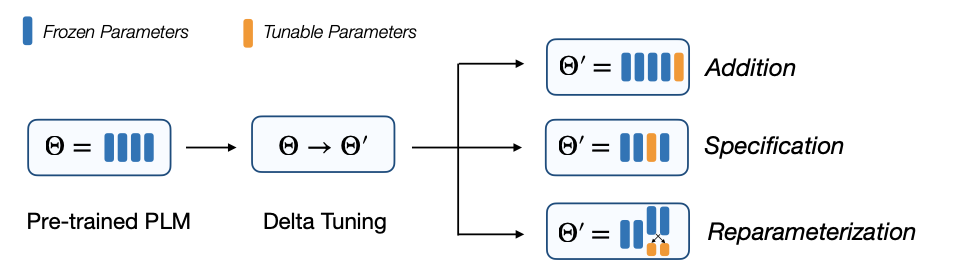

# Delta-Tuning: A Comprehensive Study of Parameter Efficient Methods for Pre-trained Language Models

[](https://www.python.org/)


**[Delta-Tuning: A Comprehensive Study of Parameter Efficient Methods for Pre-trained Language Models](https://arxiv.org/abs/2203.06904)**<br>
Ning Ding*, Yujia Qin*, Guang Yang, Fuchao Wei, Zonghan Yang, Yusheng Su, Shengding Hu, Yulin Chen, Chi-Min Chan, Weize Chen, Jing Yi, Weilin Zhao, Xiaozhi Wang, Zhiyuan Liu, Hai-Tao Zheng, Jianfei Chen, Yang Liu, Jie Tang, Juanzi Li, Maosong Sun<br>
Nature Machine Intelligence

## Quick links

* [Overview](#overview)
* [Requirements](#requirements)
* [Prepare the data](#prepare-the-data)
* [Run delta tuning for combinations](#run-delta-tuning-for-combinations)
  * [Few-shot experiments](#few-shot-experiments)
  * [Full dataset experiments](#full-dataset-experiments)
  * [How to customize your templates](#how-to-customize-your-templates)
* [Run delta tuning for task-level transferability](#run-delta-tuning-for-task-level-transferability)
* [Citation](#citation)


## Overview



The prohibitive cost of finetuning all the parameters of colossal model
has necessitates a new branch of research that focuses on the parameter-efficient adaptation of PLMs.

In contrast with standard fine-tuning, parameter-efficient adaptation only optimizes a small portion of the model parameters while keeping the rest untouched, largely reducing both the computation and storage costs.

This repository includes codebase for **combination of delta tuing methods**.

## Requirements

Our code typically runs on python version 3.6.13.

To run our code, please install all the dependency packages by using the following command:

```
pip install -r requirements.txt -f https://download.pytorch.org/whl/torch_stable.html
```

**NOTE**: The requirements are based on CUDA 11.0. Please adjust the version of `pytorch` for different CUDA version.
 Different versions of packages may lead to different results from the paper. However, the trend should still hold no matter what versions of packages you use.

## Prepare the data

We pack the original datasets (SST-2, CoLA, MNLI, QNLI, RTE, MRPC, QQP, STS-B) [here](https://cloud.tsinghua.edu.cn/f/15e7562e1e6544028d25/?dl=1). Please download it and extract the files to `./data/original`, or run the following commands for full dataset:

```bash
cd data
bash download_dataset.sh
```

Then use the following command (in the root directory) to generate the few-shot data we need:

```bash
python tools/generate_k_shot_data.py
```

See `tools/generate_k_shot_data.py` for more options. For results in the paper, we use the default options: we take `K=16` and take 5 different seeds of 13, 21, 42, 87, 100. The few-shot data will be generated to `data/k-shot`. In the directory of each dataset, there will be folders named as `$K-$SEED` indicating different dataset samples. You can use the following command to check whether the generated data are exactly the same as ours:

```bash
cd data/k-shot
md5sum -c checksum
```

**NOTE**: During training, the model will generate/load cache files in the data folder. If your data have changed, make sure to clean all the cache files (starting with "cache").

## Run Delta Tuning for Combinations

Our code is built on [adapter-transformers](https://github.com/huggingface/transformers) and we use its `1.1.1` version. Other versions of `adapter-transformers` might cause unexpected errors.

### Few-shot Experiments
----

To reproduce the results in our paper, just run the following command:

```bash
TASK=SST-2 bash run_one_task.sh
```

This command will run experiments on all combinations of delta-tuning methods (Prompt, BitFit and Adapter). You can modify `TASK` variable for different tasks and edit `run_one_task.sh` for more options.

----

If you wish to only reproduce a single experiment,
run the following command:

```bash
CUDA_VISIBLE_DEVICES=$cuda \
TASK=$TASK \
TAG=$TAG \
BS=$bs \
LR=$lr \
PROMPT=prompt \
SEED=$seed \
MODEL=$model \
HARD=$hard \
GPUN=$gpun \
NOTRAIN=$notrain \
bash run_experiment.sh "--training_params $params --use_adapters"
```

The required environment variables means:

- TAG: tag for a single run, set to distinguish different experiments.
- PROMPT: whether to use prompt (the value should be the string "prompt" or "")
- TASK: task to run, chosen from SST-2 / CoLA / MNLI / QNLI / RTE / MRPC / QQP / STS-B
- BS: batch size (recommeded batch size: 2 / 4 / 8)
- LR: learning rate (recommended learning rate: 1e-5 / 2e-5 / 5e-5)
- SEED: random seed (13 / 21 / 42 / 87 / 100)
- MODEL: pre-trained model name (roberta-*, bert-*), see Transformers model list
- HARD: whether to use hard template (chosen from "Y" or "N")
- NOTRAIN: not to train, set to 1 when there's no parameters to train
- GPUN: number of GPUs

Besides, the variable `params` should be set to a list of delta tuning methods.
For example, for combination of Prompt and BitFit, we set `params` to "prompt,bias".
The option `--use_adapters` is added only when "adapter" appears in `params`.

----

You can also specify other options such as template format by
running `run.py`. 
Before running any experiments, create the result folder by `mkdir result` to save checkpoints. Then you can run our code with the following example:

```bash
python run.py \
    --task_name SST-2 \
    --data_dir data/k-shot/SST-2/16-42 \
    --overwrite_output_dir \
    --do_train \
    --do_eval \
    --do_predict \
    --evaluation_strategy steps \
    --model_name_or_path roberta-large \
    --num_k 16 \
    --max_steps 1000 \
    --eval_steps 100 \
    --per_device_train_batch_size 2 \
    --learning_rate 1e-5 \
    --num_train_epochs 0 \
    --output_dir result/tmp \
    --seed 42 \
    --prompt_num 10 \
    --template "*cls*prompt*sent_0*_It_was*.*sep+*" \
    --mapping "{'0':'terrible','1':'great'}" \
    --num_sample 16 \
    --training_params prompt
```

Most arguments are inherited from `transformers` and are easy to understand. 
Similar to [LM-BFF](https://github.com/princeton-nlp/LM-BFF), We further explain some of the arguments:

* `few_shot_type`: There are three modes
  * `finetune`: Standard fine-tuning
  * `prompt`: Prompt-based fine-tuning.
  * `prompt-demo`: Prompt-based fine-tuning with demonstrations.
* `num_k`: Number of training instances for each class. We take `num_k`=16 in our paper. This argument is mainly used for indexing logs afterwards (because the training example numbers are actually decided by the data split you use).
* `template`: Template for prompt-based fine-tuning. We will introduce the template format later.
* `mapping`: Label word mapping for prompt-based fine-tuning. It is a string of dictionary indicating the mapping from label names to label words. **NOTE**: For RoBERTa, the model will automatically add space before the word. See the paper appendix for details.
* `num_sample`: When using demonstrations during inference, the number of samples for each input query. Say `num_sample`=16, then we sample 16 different sets of demonstrations for one input, do the forward seperately, and average the logits for all 16 samples as the final prediction.

Also, this codebase supports BERT-series and RoBERTa-series pre-trained models in Huggingface's `transformers`. You can check [Huggingface's website](https://huggingface.co/models) for available models and pass models with a "bert" or "roberta" in their names to `--model_name_or_path`. Some examples would be `bert-base-uncased`, `bert-large-uncased`, `roberta-base`, `roberta-large`, etc.


### Full Dataset Experiments

To run full-data experiments,
we just need to modify the option `--data_dir` of `run.py` to the full dataset directory.
For example, in our default setting, we use `data/original/$TASK` as the data directory.

Also, we have scripts `run_fulldataset_one_task.sh` and `run_fulldata_experiment.sh` to 
reproduce our results. 
The options are similar to the few-shot scripts.


### How to customize your templates

Here are two template examples:

For SST-2: `*cls**sent_0*_It_was*mask*.*sep+*` => `[CLS] {S0} It was [MASK]. [SEP]`

For MNLI: `*cls**sent-_0*?*mask*,*+sentl_1**sep+*` => `[CLS] {S0}? [MASK], {S1} [SEP]`

The template is composed of special tokens and variables (surrounded by `*`) and text (e.g., `It_was`, where space is replaced by `_`). Special tokens and variables contain:

* `*cls*`, `*sep*`, `*sep+*` and `*mask*`: Special tokens of CLS, SEP and MASK (different for different pre-trained models and tokenizers). `*sep+*` means the contents before and after this token have different segment embeddings (only for BERT).
* `*sent_i*`: The i-th sentence.
* `*sent-_i*`: The i-th sentence, discarding the last character.
* `*sentl_i*`: The i-th sentence, lower-casing the first letter.
* `*sentl-_i*`: The i-th sentence, discarding the last character and lower-casing the first letter.
* `*+sent_i*`: The i-th sentence, adding an extra space at the beginning.
* `*+sentl_i*`: The i-th sentence, adding an extra space at the beginning and lower-casing the first letter.

## Run Delta Tuning for Task-Level Transferability

To reproduce the result of task-level trasferability,
run the following command.

```bash
TASK=SST-2 bash run_mulstage_task.sh
```

This command will reproduce all experiments on SST-2 task
where different delta tuning methods are applied sequentially.

----

Also, to only reproduce a single experiment, run the following command.

```bash
CUDA_VISIBLE_DEVICES=$cuda \
TASK=$TASK \
TAG=$TAG \
BS=$bs \
LR=$lr \
PROMPT=prompt \
SEED=$seed \
MODEL=$model \
HARD=$hard \
GPUN=$gpun \
TRAIN_PARAM='prompt bias adapter' \
bash run_mulstage_experiment.sh "--use_adapter"
```

The variable `TRAIN_PARAM` is set to specify the order to apply different delta tuning methods.

## Acknowledge

This code is built upon [LM-BFF](https://github.com/princeton-nlp/LM-BFF).

## Citation

Please cite our paper if you use Delta Tuning in your work:

```bibtex
@article{ding2022delta,
  title={Delta tuning: A comprehensive study of parameter efficient methods for pre-trained language models},
  author={Ding, Ning and Qin, Yujia and Yang, Guang and Wei, Fuchao and Yang, Zonghan and Su, Yusheng and Hu, Shengding and Chen, Yulin and Chan, Chi-Min and Chen, Weize and others},
  journal={arXiv preprint arXiv:2203.06904},
  year={2022}
}
```
