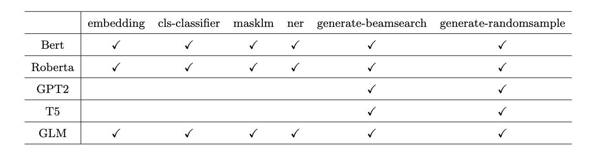

## Predictor

### Get prediction result quickly by the Predictor
By the Predictor, you only need to enter a **text**, and you can get the output of the corresponding task directly.

Take gpt2 writing tasks as an example:
```python
from flagai.auto_model.auto_loader import AutoLoader
from flagai.model.predictor.predictor import Predictor
if __name__ == '__main__':
    ## Load model and tokenizer by the autoloader
    loader = AutoLoader("seq2seq", "GPT2-base-ch", model_dir="./state_dict/")
    model = loader.get_model()
    tokenizer = loader.get_tokenizer()
    ## Define the Predictor
    predictor = Predictor(model, tokenizer)
    ## Define the start of the text as the input.
    text = "今天天气不错，"
    ## The predictor can analyse the model automatically to call different method.
    out = predictor.predict_generate_randomsample(text,  ## input
                                                  input_max_length=512,  ## input max length
                                                  out_max_length=100, ## output max lenght
                                                  repetition_penalty=1.5, ## avoid the repetition out. (https://arxiv.org/pdf/1909.05858.pdf)
                                                  top_k=20,  ## keep only top k tokens with highest probability (top-k filtering).
                                                  top_p=0.8) ## keep the top tokens with cumulative probability >= top_p (nucleus filtering).(http://arxiv.org/abs/1904.09751)

    print(f"out is {out}")
    ### out is  到这里来看了一下，很是兴奋，就和朋友一起来这里来了。我们是周五晚上去的，人不多，所以没有排队，而且这里的环境真的很好，在这里享受美食真的很舒服，我们点了一个套餐，两个人吃刚刚好，味道很好。
```

### All supported prediction method
1. predict_embedding: Input a text to get the embedding representation.
2. predict_cls_classifier: Input a text or a text-pair to get the multi-class result, support the bert, roberta and other transformer encoder models.
3. predict_masklm: Input a text with [MASK] tokens to get the result of original text, support the bert, roberta and other transformer encoder models.
4. predict_ner: Input a text to get the ner result, support the bert, roberta and other transformer encoder models.
5. predict_generate_beamsearch: Input a text to get the output text, seq2seq task. support the bert, roberta, gpt2, t5 and glm models.
6. predict_generate_randomsample: Input a text to get the output text, seq2seq task. support the bert, roberta, gpt2, t5 and glm models.
7. predict_generate_contrastive_search: Input a text to get the output text, seq2seq task. support the gpt2, opt models. [**SimCTG Contrastive Search**](https://github.com/yxuansu/SimCTG)


